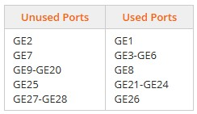

# Module 10 (Labs 10-19): Applying Network Security Features
## Lab 10.10: Disable Switch Ports - GUI
Complete this lab as follows:  
### Log in to the CISCO switch.
In the Google Chrome URL field, enter 192.168.0.2 and press Enter.  
Maximize the window for better viewing.  
In the Username and Password fields, enter cisco (case sensitive).  
Select Log In.  
### Disable port GE9.
From the left navigation bar, expand and select Port Management > Port Settings.  
Select GE9 (port 9) and then select Edit.  
For Administrative Status, select Down.  
Select Apply.  
Select Close.  
### Copy GE9 port settings to ports 12 and 14-17.
Select GE9 and then select Copy Settings.  
Type 12,14-17 in the To: field.  
Select Apply.  
### Save the changes to the switch's startup configuration file.
From the upper right of the switch window, select Save.  
For Source File Name, make sure Running configuration is selected.  
For Destination File Name, make sure Startup configuration is selected.  
Select Apply.  
Select OK.  
Select Done.  
## Lab 10.11: Harden a Switch
While completing this lab, use the following information:
  
Complete this lab as follows:  
### Shut down the unused ports.
Under Initial Setup, select Configure Port Settings.  
Select the GE2 port.  
Scroll down and select Edit.  
Under Administrative Status, select Down.  
Scroll down and select Apply.  
Select Close.  
With the GE2 port selected, scroll down and select Copy Settings.  
In the Copy configuration field, enter the remaining unused ports. (View the example for the proper syntax.)  
Select Apply. From the Port Setting Table, in the Port Status column, you can see that all the ports are down now.  
### Configure the Port Security settings.
From the left menu, expand Security.  
Select Port Security.  
Select the GE1 port.  
Scroll down and select Edit.  
For Interface Status, select Lock.  
For Learning Mode, make sure Classic Lock is selected.  
For Action on Violation, make sure Discard is selected.  
Select Apply.  
Select Close.  
Scroll down and select Copy Settings.  
Enter the remaining used ports. (View the example for the proper syntax.)  
Select Apply.  
## Lab 10.12: Configure Network Security Appliance Access
Complete this lab as follows:  
### Access the pfSense management console.
From the taskbar, select Google Chrome.  
Maximize the window for better viewing.  
In the Google Chrome address bar, enter 198.28.56.22 and then press Enter.  
Enter the pfSense sign-in information as follows:  
&emsp; * Username: admin  
&emsp; * Password: pfsense  
Select SIGN IN.  
### Change the password for the default (admin) account.
From the pfSense menu bar, select System > User Manager.  
For the admin account, under Actions, select the Edit user icon (pencil).  
For Password, change to P@ssw0rd (0 = zero).  
Enter P@ssw0rd in the Confirm Password field.  
Scroll to the bottom and select Save.  
### Create and configure a new pfSense user.
Select Add.  
Enter lyoung as the username.  
Enter C@nyouGuess!t in the Password field.  
Enter C@nyouGuess!t in the Confirm Password field.  
Enter Liam Young in Full Name field.
For Group membership, select admins and then select Move to "Member of" list.  
Scroll to the bottom and select Save.  
### Set a session timeout for pfSense.
Under the System breadcrumb, select Settings.  
For Session timeout, enter 20.  
Select Save.  
### Disable the webConfigurator anti-lockout rule for HTTP.
From the pfSense menu bar, select System > Advanced.  
Under webConfigurator, for Protocol, select HTTP.  
Scroll down and select Anti-lockout to disable the webConfigurator anti-lockout rule.  
Scroll to the bottom and select Save.  
## Lab 10.13: Configure a Security Appliance
Complete this lab as follows:  
### Access the pfSense management console.
Sign in using the following case-sensitive information:  
&emsp; * Username: admin  
&emsp; * Password: P@ssw0rd  
Select SIGN IN or press Enter.  
### Configure the DNS Servers.
From the pfSense menu bar, select System > General Setup.  
Under DNS Server Settings, configure the primary DNS Server as follows:  
&emsp; * Address: 163.128.78.93  
&emsp; * Hostname: DNS1  
&emsp; * Gateway: None  
Select Add DNS Server to add a secondary DNS Server and then configure it as follows:  
&emsp; * Address: 163.128.80.93  
&emsp; * Hostname: DNS2  
&emsp; * Gateway: None  
Scroll to the bottom and select Save.  
### Configure the WAN settings.
From the pfSense menu bar, select Interfaces > WAN.  
Under General Configuration, ensure Enable interface is selected.  
Use the IPv4 Configuration Type drop-down to select Static IPv4.  
Under Static IPv4 Configuration, in the IPv4 Address field, enter 65.86.24.136.  
Use the IPv4 Address subnet drop-down to select 8.  
Under Static IPv4 Configuration, select Add a new gateway.  
Configure the gateway settings as follows:  
&emsp; * Default: Select Default gateway  
&emsp; * Gateway name: Enter WANGateway  
&emsp; * Gateway IPv4: 65.86.1.1  
Select Add.  
Scroll to the bottom and select Save.  
Select Apply Changes.  
## Lab 10.14: Configure a Perimeter Firewall
Complete this lab as follows:  
### Sign in to the pfSense management console.
In the Username field, enter admin.  
In the Password field, enter P@ssw0rd (zero).  
Select SIGN IN or press Enter.  
### Create and configure a firewall rule to pass HTTP traffic from the WAN to the Web server in the DMZ.
From the pfSense menu bar, select Firewall > Rules.  
Under the Firewall breadcrumb, select DMZ.  
Select Add (either one).  
Make sure Action is set to Pass.  
Under Source, use the drop-down to select WAN net.  
Under Destination, use the Destination drop-down to select Single host or alias.  
In the Destination Address field, enter 172.16.1.5.  
Using the Destination Port Range drop-down, select HTTP (80).  
Under Extra Options, in the Description field, enter HTTP from WAN to DMZ.  
Select Save.  
Select Apply Changes.  
### Create and configure a firewall rule to pass HTTPS traffic from the WAN to the Web server in the DMZ.
For the rule just created, select the Copy icon (two files).  
Under Destination, change the Destination Port Range to HTTPS (443).  
Under Extra Options, change the Description field to HTTPS from WAN to DMZ.  
Select Save.  
Select Apply Changes.  
### Create and configure a firewall rule to pass all traffic from the LAN network to the DMZ network.
Select Add (either one).  
Make sure Action is set to Pass.  
For Protocol, use the drop-down to select Any.  
Under Source, use the drop-down to select LAN net.  
Under Destination, use the drop-down to select DMZ net.  
Under Extra Options, change the Description field to LAN to DMZ Any.  
Select Save.  
Select Apply Changes.  
## Lab 10.15: Restrict Telnet and SSH Access
Complete this lab as follows:  
### Enter the configuration mode for the router:
From the exhibit, select the router.  
From the terminal, press Enter.  
Type enable and then press Enter.  
Type config term and then press Enter.  
### From the terminal, create a standard numbered access list using number 5. Add a permit statement for each network to the access list.
Type access-list 5 permit 192.168.1.0  0.0.0.255 and then press Enter.  
Type access-list 5 permit 192.168.2.0  0.0.0.255 and then press Enter.  
Type access-list 5 permit 192.168.3.0  0.0.0.255 and then press Enter.  
### Apply the access list to VTY lines 0–4. Filter incoming traffic.
Type line vty 0 4 and then press Enter.  
Type access-class 5 in and then press Enter.  
Press Ctrl + Z.  
### Save your changes in the startup-config file.
Type copy run start and then press Enter.  
Press Enter to begin building the configuration.  
Press Enter.  
## Lab 10.16: Permit Traffic
Complete this lab as follows:  
### Enter the configuration mode for the Fiji router:
From the exhibit, select the Fiji router.  
From the terminal, press Enter.  
Type enable and then press Enter.  
Type config term and then press Enter.  
### From the terminal, add a permit any statement to Access List 11 to allow all traffic other than the restricted traffic.
Type access-list 11 permit any and press Enter.  
Press Ctrl + Z.  
### Save your changes in the startup-config file.
Type copy run start and then press Enter.  
Press Enter to begin building the configuration.  
Press Enter.  
## Lab 10.17: Block Source Hosts
Complete this lab as follows:  
### Enter the configuration mode for the router:
From the exhibit, select the router.  
From the terminal, press Enter.  
Type enable and then press Enter.  
Type config term and then press Enter.  
### From the terminal, create a standard numbered access list using number 25. Add statements to the access list to block traffic to the required hosts.
Type access-list 25 deny host 199.68.111.199 and press Enter.  
Type access-list 25 deny host 202.177.9.1 and press Enter.  
Type access-list 25 deny host 211.55.67.11 and press Enter.  
### From the terminal, add a statement to allow all other traffic from all other hosts, by typing access-list 25 permit any and pressing Enter.
### From the terminal, apply Access List 25 to the Serial0/0/0 interface to filter incoming traffic.
Type int s0/0/0 and press Enter.  
Type ip access  
### Applied Live Lab 10.18: Troubleshoot Service and Security Issues
Live Lab.  