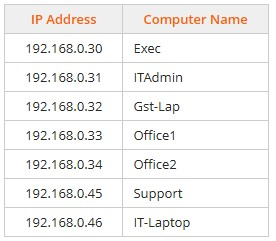
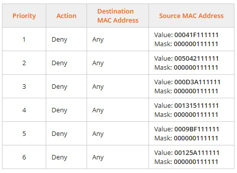

# Module 10 Labs: Applying Network Security Features
## Live Lab 10.1: Deploy a Digital Certificate
Live Lab.  
## Lab 10.2: Manage Account Policies
While completing this lab, use the following information:  
  
Complete this lab as follows:  
### Access the CorpDC virtual server.
In Hyper-V Manager, select CORPSERVER.  
Under Virtual Machines, double-click CorpDC to connect to the virtual server.  
### Modify password policies.
From Server Manager, select Tools > Group Policy Management.  
Maximize the window for better viewing.  
From the left pane, expand Forest: CorpNet.local > Domains > CorpNet.local.  
Right-click Default Domain Policy and select Edit.  
Maximize the window for better viewing.  
Under Computer Configuration, expand Policies > Windows Settings > Security Settings > Account Policies.  
Select Password Policy.  
From the right pane, double-click the policy that you want to edit.  
Make sure that Define this policy setting is selected.  
Edit the value for the policy and then select OK.  
Repeat steps 2h–2j for each policy.  
### Modify account lockout policies.
From the left pane, select Account Lockout Policy.  
From the right pane, double-click the policy that you want to edit.  
Make sure that Define this policy setting is selected.  
Edit the value for the policy and then select OK.  
Repeat steps 3b–3d for additional policies.  
## Live Lab 10.3: Configure Management Privileges
Live Lab.  
## Lab 10.4: View Linux Services
Complete this lab as follows:  
### Start the Bluetooth service using the systemctl command.
From the Favorites bar, select Terminal.  
At the prompt, type systemctl start bluetooth.service and then press Enter.  
Type systemctl is-active bluetooth.service to verify that the service is active.  
### Stop the Bluetooth service using the systemctl command.
At the prompt, type systemctl stop bluetooth.service and then press Enter.  
Type systemctl is-active bluetooth.service to verify that the service is inactive.  
### Restart the Bluetooth service using the systemctl command.
At the prompt, type systemctl restart bluetooth.service and then press Enter.  
Type systemctl is-active bluetooth.service to verify that the service is active.  
## Lab 10.5: Scan for Unsecure Protocols
Complete this lab as follows:  
### From the Analyst-Lap computer, find the domain name servers used by partnercorp.xyz.
From the taskbar, select Google Chrome.  
Maximize the windows for better viewing.  
In the URL field, type whois.org and press Enter.  
In the Search for a domain name field, enter partnercorp.xyz.  
Select Search  
In the top right, select Questions.  
Answer Question 1.  
### Find the IP address used by www.partnernetcorp.xyz.
Right-click Start and select Terminal (Admin).  
At the PowerShell prompt, type nslookup www.partnercorp.xyz name_server (see the answer to question 1) and press Enter.  
Answer Question 2.  
Minimize the question dialog.  
### Use Zenmap to run an Nmap command to scan for open ports.
From the navigation tabs, select Buildings.  
Under Blue Cell, select Analyst-Lap2.  
From the Favorites bar, select Zenmap.  
Maximize Zenmap for easier viewing.  
In the Command field, use nmap --top-ports 50 73.44.215.0/24 to scan for open ports.  
Select Scan to scan for open ports on all servers located on this network.  
In the top right, select Questions.  
Answer Question 3.  
## Lab 10.6: Enable and Disable Linux Services
Complete this lab as follows:
### Enable the Anaconda service.
From the favorites bar, launch a terminal.  
At the prompt, type systemctl enable anaconda.service and then press Enter.  
Type systemctl is-enabled anaconda.service and then press Enter to check the service's status.
### Disable the VMware tools service.
Type systemctl disable vmtoolsd.service and press Enter.  
Type systemctl is-enabled vmtoolsd.service and press Enter to check the service's status.  
## Lab 10.7: Disable Network Service
While completing this lab, use the following information:  
Ports to scan:  
&emsp; * 3389 - Remote Desktop Services (TermServices)  
&emsp; * 5900 - VNC Server (vncserver)  
&emsp; * Computer identification:  
  
Complete this lab as follows:  
### Using Zenmap, scan the network for open remote access ports.
From the Favorites bar, select Zenmap.  
Maximize the window for better viewing.  
In the Command field, use nmap -p [port number] 192.168.0.0/24 to scan the port.  
Select Scan (or press Enter) to scan the subnet for a given service.  
Using the table in the scenario, identify the computer(s) with the open port using the IP address found.  
From the top right, select Questions.  
Answer Question 1.  
Repeat steps 1c-1e and then answer Question 2.  
### For computers that have a remote access service port open, disable and then stop the applicable service from running.
From the top left, select Floor 1 Overview.  
Select the computer with the remote access service port open. If needed, minimize or move the Lab Questions dialog.  
Right-click Start and select Computer Management.  
From the left pane, expand and select Services and Applications > Services.  
Maximize the window for better viewing.  
Double-click the service (Remote Desktop Services or VNC Server) that needs to be stopped.  
Using the Startup type drop-down menu, select Disabled.  
Under Service status, select Stop.  
Select OK.  
Repeat step 2a-2i.  
From the top right, select Questions.  
&emsp; You would also want to remove or uninstall these services.  
## Lab 10.7: Disable Network Service
While completing this lab, use the following information:  
&emsp; * Ports to scan:  
&emsp; &emsp; * 3389 - Remote Desktop Services (TermServices)  
&emsp; &emsp; * 5900 - VNC Server (vncserver)  
&emsp; * Computer identification:  
  
Complete this lab as follows:  
### Using Zenmap, scan the network for open remote access ports.
From the Favorites bar, select Zenmap.  
Maximize the window for better viewing.  
In the Command field, use nmap -p [port number] 192.168.0.0/24 to scan the port.  
Select Scan (or press Enter) to scan the subnet for a given service.  
Using the table in the scenario, identify the computer(s) with the open port using the IP address found.  
From the top right, select Questions.  
Answer Question 1.  
Repeat steps 1c-1e and then answer Question 2.  
### For computers that have a remote access service port open, disable and then stop the applicable service from running.
From the top left, select Floor 1 Overview.  
Select the computer with the remote access service port open. If needed, minimize or move the Lab Questions dialog.  
Right-click Start and select Computer Management.  
From the left pane, expand and select Services and Applications > Services.  
Maximize the window for better viewing.  
Double-click the service (Remote Desktop Services or VNC Server) that needs to be stopped.
Using the Startup type drop-down menu, select Disabled.  
Under Service status, select Stop.  
Select OK.  
Repeat step 2a-2i.  
From the top right, select Questions.  
&emsp; You would also want to remove or uninstall these services.  
### Lab 10.8: Secure Access to a Switch
Complete this lab as follows:  
### Create and configure an Access Profile named MgtAccess.
From the left pane, expand and select Security > Mgmt Access Method > Access Profiles.  
Select Add.  
Enter the Access Profile Name of MgtAccess.  
Enter the Rule Priority of 1.  
For Action, select Deny.  
Select Apply and then select Close.  
### Add a profile rule to the MgtAccess profile.
From the left pane, under Security > Mgmt Access Method, select Profile Rules.  
From the right pane, select the MgtAccess profile and then select Add.  
Enter a Rule Priority of 2.  
For Management Method, select HTTP.  
For Applies to Source IP Address, select User Defined.  
For IP Address, enter 192.168.0.10.  
For Mask, enter a Network Mask of 255.255.255.0.  
Select Apply and then select Close.  
### Set the MgtAccess profile as the active access profile.
From the left pane, under Security > Mgmt Access Method, select Access Profiles.  
Use the Active Access Profile drop-down list to select MgtAccess.  
Select Apply.  
Select OK.  
S### ave the changes to the switch's startup configuration file.  
At the top, select Save.  
On the right, under Source File Name, make sure Running configuration is selected.  
For the Destination File Name, make sure Startup configuration is selected.  
Select Apply.  
Select OK.  
## Lab 10.9: Secure Access to a Switch 2
While completing this lab, use the following information:  
&emsp; * Configure the GameConsoles MAC-based access control entry (ACE) settings as follows:  
  
Complete this lab as follows:  
### Create the GameConsoles ACL.
From the Getting Started page, under Quick Access, select Create MAC-Based ACL.  
Select Add.  
In the ACL Name field, enter GameConsoles.  
Select Apply and then select Close.  
Create a MAC-based access control.  
### Select MAC-Based ACE Table.
Select Add.  
Enter the priority.  
Select the action.  
For Destination MAC Address, make sure Any is selected.  
For Source MAC Address, select User Defined.  
Enter the source MAC address value.  
Enter the source MAC address mask.  
Select Apply.  
Repeat steps 2c–2i for the remaining ACE entries.  
Select Close.  
### Bind the GameConsoles ACL to all of the interfaces.
From the left pane, under Access Control, select ACL Binding (Port).  
Select GE1.  
At the bottom of the window, select Edit.  
Select Select MAC-Based ACL.  
Select Apply and then select Close.  
Select Copy Settings.  
In the Copy configuration's to field, enter 2-30.  
Select Apply.  
### Save the Configuration.
From the top of the window, select Save.  
Under Source File Name, make sure Running configuration is selected.  
Under Destination File Name, make sure Startup configuration is selected.  
Select Apply.  
Select OK.  
## Lab 10.10: Disable Switch Ports - GUI
Complete this lab as follows:  
### Log in to the CISCO switch.
In the Google Chrome URL field, enter 192.168.0.2 and press Enter.  
Maximize the window for better viewing.  
In the Username and Password fields, enter cisco (case sensitive).  
Select Log In.  
### Disable port GE9.
From the left navigation bar, expand and select Port Management > Port Settings.  
Select GE9 (port 9) and then select Edit.  
For Administrative Status, select Down.  
Select Apply.  
Select Close.  
### Copy GE9 port settings to ports 12 and 14-17.
Select GE9 and then select Copy Settings.  
Type 12,14-17 in the To: field.  
Select Apply.  
### Save the changes to the switch's startup configuration file.
From the upper right of the switch window, select Save.  
For Source File Name, make sure Running configuration is selected.  
For Destination File Name, make sure Startup configuration is selected.  
Select Apply.  
Select OK.  
Select Done.  
## Lab 10.11: Harden a Switch
While completing this lab, use the following information:
  
Complete this lab as follows:  
### Shut down the unused ports.
Under Initial Setup, select Configure Port Settings.  
Select the GE2 port.  
Scroll down and select Edit.  
Under Administrative Status, select Down.  
Scroll down and select Apply.  
Select Close.  
With the GE2 port selected, scroll down and select Copy Settings.  
In the Copy configuration field, enter the remaining unused ports. (View the example for the proper syntax.)  
Select Apply. From the Port Setting Table, in the Port Status column, you can see that all the ports are down now.  
### Configure the Port Security settings.
From the left menu, expand Security.  
Select Port Security.  
Select the GE1 port.  
Scroll down and select Edit.  
For Interface Status, select Lock.  
For Learning Mode, make sure Classic Lock is selected.  
For Action on Violation, make sure Discard is selected.  
Select Apply.  
Select Close.  
Scroll down and select Copy Settings.  
Enter the remaining used ports. (View the example for the proper syntax.)  
Select Apply.  
## Lab 10.12: Configure Network Security Appliance Access
Complete this lab as follows:  
### Access the pfSense management console.
From the taskbar, select Google Chrome.  
Maximize the window for better viewing.  
In the Google Chrome address bar, enter 198.28.56.22 and then press Enter.  
Enter the pfSense sign-in information as follows:  
&emsp; * Username: admin  
&emsp; * Password: pfsense  
Select SIGN IN.  
### Change the password for the default (admin) account.
From the pfSense menu bar, select System > User Manager.  
For the admin account, under Actions, select the Edit user icon (pencil).  
For Password, change to P@ssw0rd (0 = zero).  
Enter P@ssw0rd in the Confirm Password field.  
Scroll to the bottom and select Save.  
### Create and configure a new pfSense user.
Select Add.  
Enter lyoung as the username.  
Enter C@nyouGuess!t in the Password field.  
Enter C@nyouGuess!t in the Confirm Password field.  
Enter Liam Young in Full Name field.
For Group membership, select admins and then select Move to "Member of" list.  
Scroll to the bottom and select Save.  
### Set a session timeout for pfSense.
Under the System breadcrumb, select Settings.  
For Session timeout, enter 20.  
Select Save.  
### Disable the webConfigurator anti-lockout rule for HTTP.
From the pfSense menu bar, select System > Advanced.  
Under webConfigurator, for Protocol, select HTTP.  
Scroll down and select Anti-lockout to disable the webConfigurator anti-lockout rule.  
Scroll to the bottom and select Save.  