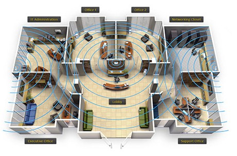

# Module 12 (Labs 1 - 6): Configuring Wireless Networks
## Lab 12.1: Configure Wireless Profiles
Complete this lab as follows:  
### Manually create the wireless network profile on the laptop.
Right-click Start and then select Settings.  
Select Network & Internet.  
Select Wi-Fi.  
Select Manage known networks.  
Select Add Network.  
In the Network name field, enter PoliceVan.  
Use the Security type drop-down menu to select WPA2-Personal AES.  
In the Security Key field, enter 4WatchingU.  
Select Connect automatically.  
Select Connect even if the network is not broadcasting and then click Save.  
### Delete the out-of-date profile.
From Manage known networks, next to the TrendNet-BGN profile select Forget.  
## Lab 12.2: Design an Indoor Wireless Network
Only three WAPs are required to complete this lab (one omnidirectional WAP and two directional WAPs).  
The following WAP configuration provides adequate coverage and reduces signal emanation.  
  
Complete this lab as follows:  
### Under Shelf, expand Wireless Access Points.
&emsp; * Drag the Wireless Access Point (Indoor, omnidirectional Antenna) to the installation area in the Lobby.  
&emsp; * Drag one Wireless Access Point (Indoor, directional Antenna) to the installation area on the west wall of the IT Administration office.  
&emsp; * Drag another Wireless Access Point (Indoor, directional Antenna) to the installation area on the east wall of the Networking Closet.  
## Lab 12.3: Design an Outdoor Wireless Network
Complete this lab as follows:  
### Install the High-gain Antenna (Directional) on buildings A and B.
Under Shelf, expand High-gain Antennas.  
Drag the High-gain Antenna (Directional) to the installation area on the roof of Building A.  
Drag the remaining High-gain Antenna (Directional) to the installation area on the roof of Building B.  
### Install the wireless access point for buildings A and B.
Under Shelf, expand Wireless Access Points.  
Drag a Wireless Access Point (Outdoor) to the installation area on the roof of Building A.  
Drag the remaining Wireless Access Point (Outdoor) to the installation area on the roof of Building B.  
### Install the antennas.
Under Shelf, expand WAP Antennas.  
Drag the WAP Antenna (Directional) to one of the installed outdoor WAPs.  
Drag the remaining WAP Antenna (Directional) to the other installed outdoor WAP.  
## Lab 12.4: Implement an Enterprise Wireless Network
Complete this lab as follows:  
### Access the Ruckus zone controller.
From the taskbar, select Google Chrome.  
In the URL field, enter 192.168.0.6 and press Enter.  
Maximize the window for better viewing.  
### Log into the Wireless Controller console.
In the Admin field, enter admin (case-sensitive).  
In the Password field, enter password as the password.  
Select Login.  
### Create a new WLAN.  
Select the Configure tab.  
From the left menu, select WLANs.  
From the right, under WLANs, select Create New.  
In the New Name field, enter CorpNet Wireless.  
In the ESSID field, enter CorpNet.  
Under Type, make sure Standard Usage is selected.  
Under Authentication Options, make sure Open is selected.  
Under Encryption Options, select WPA2.  
For Algorithm, make sure AES is selected.  
In the Passphrase field, enter @CorpNetWeRSecure!.  
Select OK.  
### Switch to the Exec-Laptop.
From the top left, select Floor 1.  
Under Executive Office, select Exec-Laptop.  
### Connect to the new CorpNet wireless network.
In the notification area, select the globe icon, then the arrow next to the wireless icon to view the available networks.  
Select CorpNet.  
Make sure Connect automatically is selected.  
Select Connect.  
Enter @CorpNetWeRSecure! for the security key.  
Select Next.  
## Lab 12.5: Configure a Captive Portal
Complete this lab as follows:  
### Sign in to the pfSense management console.
In the Username field, enter admin.  
In the Password field, enter P@ssw0rd (zero).  
Select SIGN IN or press Enter.  
### Add a Captive Portal zone.  
From the pfSense menu bar, select Services > Captive Portal.  
Select Add.  
For Zone name, enter Guest_WiFi.  
For Zone description, enter Zone used for the guest Wi-Fi.  
Select Save & Continue.  
### Enable and configure the Captive Portal.  
Under Captive Portal Configuration, select Enable.  
For Interfaces, select GuestWi-Fi.  
For Maximum concurrent connections, select 100.  
For Idle timeout, enter 30.  
For Hard timeout, enter 120.  
Scroll down and select Per-user bandwidth restriction.  
For Default download (Kbit/s), enter 8000.  
For Default upload (Kbit/s), enter 2500.  
Under Authentication, use the drop-down menu to select None, don't authenticate users.  
Scroll to the bottom and select Save.  
### Allow a MAC address to pass through the portal.  
From the Captive Portal page, select the Edit Zone icon (pencil).  
Under the Services breadcrumb, select MACs.  
Select Add.  
Make sure the Action field is set to Pass.  
For Mac Address, enter 00:00:1B:12:34:56.  
Select Save.  
### Allow an IP address to pass through the portal.
Under the Servic  es breadcrumb, select Allowed IP Addresses.  
Select Add.  
For IP Address, enter 198.28.1.100.  
Use the IP address drop-down menu to select 16. This sets the subnet mask to 255.255.0.0.  
For the Description field, enter Admin's Laptop.  
Make sure Direction is set to Both.  
Select Save.  
## Lab 12.6: Create a Guest Network for BYOD
Complete this lab as follows:  
### Open the Ruckus ZoneDirector.
In the Google Chrome URL field, enter 192.168.0.6 and press Enter.  
Maximize Google Chrome.  
Log in using the following information:  
&emsp; * Admin Name: WirelessAdmin (case sensitive).  
&emsp; * Password: Adminsonly! (case sensitive).  
Select Login.  
### Set up Guest Access Services.  
Select the Configure tab.  
From the left menu, select Guest Access.  
Under Guest Access Service, select Create New.  
In the Name field, use Guest_BYOD.  
For Authentication, make sure Use guest pass authentication is selected.  
For Terms of Use, select Show terms of use.  
For Redirection, make sure Redirect to the URL that the user intends to visit is selected.  
Expand Restricted Subnet Access.  
Verify that 192.168.0.0/16 is listed.  
Select OK.  
### Create a guest WLAN.
From the left menu, select WLANs.  
Under WLANs, select Create New.  
In the Name field, use Guest.  
In the ESSID field, use Guest_BYOD.  
For Type, select Guest Access.  
Confirm the following settings are set:  
&emsp; * Authentication Options: Open  
&emsp; * Encryption Options: None  
&emsp; * Guest Access Service: Guest_BYOD  
For Wireless Client Isolation, select Isolate wireless client traffic from other clients on the same AP.  
Select OK.  
Close the Google Chrome browser.  
### Request a guest password.
Open a new Google Chrome browser window.  
Maximize the window for better viewing.  
In the URL field, enter 192.168.0.6/guestpass and press Enter.  
Log in using the following information:  
&emsp; * Admin Name: BYODAdmin (case sensitive).  
&emsp; * Password: @dmin1s (case sensitive).  
Select Log In.  
In the Full Name field, enter any full name.  
In the Key field, highlight the key and press Ctrl + C to copy the key.  
Select Next.  
### Access the wireless Guest Access service from the guest laptop in the lobby.
From the top left, select Floor 1.  
Under Lobby, select Gst-Lap.  
In the Notification area, select the wireless network icon.  
Select Guest_BYOD.  
Select Connect.  
Select Yes to allow the device to be discoverable.  
After checking network requirements, the browser opens to the Guest Access login page.  
In the Guest Pass field, press Ctrl + V to paste the key copied from the Key field.  
Select Log In.  

