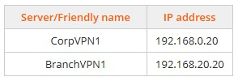

# Module 13 Labs: Comparing Remote Access Methods
## Lab 13.1: Configure a Remote Access VPN
While completing this lab, use the following information:  
Create and configure the following standard remote VPN users:  
  
Complete this lab as follows:  
### Sign in to the pfSense management console.
In the Username field, enter admin.  
In the Password field, enter P@ssw0rd (zero).  
Select SIGN IN or press Enter.  
### Start the VPN wizard and select the authentication backend type.
From the pfSense menu bar, select VPN > OpenVPN.  
From the breadcrumb, select Wizards.  
Under Select an Authentication Backend Type, make sure Local User Access is selected.  
Select Next.  
### Create a new certificate authority certificate.
For Descriptive Name, enter CorpNet-CA.  
For Country Code, enter GB.  
For State, enter Cambridgeshire.  
For City, enter Woodwalton.  
For Organization, enter CorpNet.  
Select Add new CA.  
### Create a new server certificate.
For Descriptive Name, enter CorpNet.  
Verify that all of the previous changes (Country Code, State/Providence, and City) are the same.  
Use all other default settings.  
Select Create new Certificate.  
### Configure the VPN server.
Under General OpenVPN Server Information:  
&emsp; * Use the Interface drop-down menu to select WAN.  
&emsp; * Verify that the Protocol is set to UDP on IPv4 only.  
&emsp; * For Description, enter CorpNet-VPN.  
Under Tunnel Settings:  
&emsp; * For Tunnel Network, enter 198.28.20.0/24.  
&emsp; * For Local Network, enter 198.28.56.18/24.  
&emsp; * For Concurrent Connections, enter 4.  
Under Client Settings, in DNS Server1, enter 198.28.56.1.  
Select Next.  
### Configure the firewall rules.
Under Traffic from clients to server, select Firewall Rule.  
Under Traffic from clients through VPN, select OpenVPN rule.  
Select Next.  
Select Finish.  
### Set the OpenVPN server just created to Remote Access (User Auth).
For the WAN interface, select the Edit Server icon (pencil).  
For Server mode, use the drop-down and select Remote Access (User Auth).  
Scroll to the bottom and select Save.  
### Configure the following Standard VPN users.
From the pfSense menu bar, select System > User Manager.  
Select Add.  
Configure the User Properties as follows:  
&emsp; * Username: Username  
&emsp; * Password: Password  
&emsp; * Full name: Fullname  
Scroll to the bottom and select Save.  
Repeat steps 8b-8d to create the remaining VPN users.  
## Lab 13.2 : Configure an iPad VPN Connection
Complete this lab as follows:  
### Verify your connection to the Home-Wireless network.
Select Settings.  
Select Wi-Fi.  
From the right, notice that you are connected to the Home-Wireless network.  
### Add and configure a VPN.
From the left menu, select General.  
From the right menu, select VPN.  
Select Add VPN Configuration.  
Select IPSec.  
Configure the IPSec options as follows:  
&emsp; * Description: CorpNetVPN.  
&emsp; * Server: 198.28.56.22  
A&emsp; * ccount: mbrown  
&emsp; * Secret: asdf1234$  
In the upper right, select Save.  
### Connect to the VPN just created.
Under VPN Configuration, slide Not Connected to ON.  
When prompted, enter L3tM31nN0w (0 = zero) as the password.  
Select OK.  
## Lab 13.3: Configure a RADIUS Solution
To complete this lab, use the following information:  
  
&emsp; * Configure routing and remote access on BranchVPN1 and CorpVPN1  
Complete this lab as follows:  
### Add the Network Policy and Access Services Role.
From Server Manager, select Manage > Add Roles and Features.  
Select Next to begin the Add Roles and Features Wizard.  
Select Next to use the Role-based or feature-based installation type.  
Select Next to use Select a server from a server pool and CorpNPS.CorpNet.local as the destination server.  
Select the Network Policy and Access Services role.  
Select Add Features to include management tools and then select Next.  
Select Next.  
Select Next.  
Select Next to use the Network Policy Server role service.  
Select Install.  
After the installation completes, select Close.  
### Configure clients on the RADIUS server.
From Server Manager, select Tools > Network Policy Server.  
Maximize the windows for better viewing.  
From the left pane, expand RADIUS Clients and Servers.
Right-click RADIUS Clients and then select New.  
Enter the Friendly name.  
Enter the Address (IP or DNS).  
At the bottom, in the Shared secret field, enter J51nj3T% as the shared secret.  
In the Confirm shared secret field, re-enter the shared secret.  
Select the Advanced tab.  
In the Vendor name field, make sure Radius Standard is selected.  
Select OK.  
Repeat 2d–2k for additional Radius clients.  
### Create a network policy and add a group.
From the left pane, expand Policies.  
Right-click Network Policies and select New.  
Enter Sales in the Policy name field.  
Using the Type of network access server drop-down list, select Remote Access Server (VPN-Dialup) and then select Next.  
Select Add to add group membership as a condition.  
Under Groups, select User Groups and then select Add.  
Select Add Groups.  
Enter Sales under Enter the object names to select.  
Select OK.  
Select OK.  
Select Next.  
Select Next to use the default of Access granted.  
Select Add.  
Select OK to use the default of Microsoft: Smart card or other certificate.  
Under Less secure authentication methods, unmark all the authentication methods and then select Next.  
Select Next, to use the default settings for the Configure Constraints dialog.  
Select Next, to use the default settings for the Configure Settings dialog.  
Select Finish.  
### Configure a RADIUS client.
From the top left, select Sites.  
Select the server to be configured as a RADIUS Client.  
From Server Manager, select Tools > Routing and Remote Access.  
Right-click the server and select Properties.  
Select the Security tab.  
Use the Authentication provider drop-down list to select RADIUS Authentication.  
Select Configure.  
Select Add.  
Enter CorpNPS in the Server name field.  
Next to Shared secret, select Change.  
In the New secret field, enter J51nj3T% as the secret.  
&emsp; This password must be identical to the one that was entered on the NPS server.  
In the Confirm new secret field, re-enter the shared secret; then select OK.  
Select OK to add the RADIUS server.  
Select OK to close the RADIUS Authentication dialog.  
Use the Accounting provider drop-down list to select RADIUS Accounting.  
Select Configure.  
Select Add.  
Enter CorpNPS in the Server name field.  
Next to Shared secret, select Change.  
In the New secret field, enter J51nj3T% as the secret. This password must be identical to the one that was entered on the NPS server.  
In the Confirm new secret field, re-enter the shared secret; then select OK to add the RADIUS server.  
Select OK to close the Add RADIUS Server dialog.  
Select OK to close the RADIUS Accounting dialog.  
Select OK to close server properties.  
Repeat step 4 to add the additional RADIUS Client.  
## Lab 13.4: Allow Remote Desktop Connections
Complete this lab as follows:  
### Configure Office1 to allow connections from Remote Desktop.
Right-click Start and select Settings.  
From the right pane, scroll down and select Remote Desktop.  
Under Remote Desktop, slide the button to the right.  
Select Confirm.  
### Add Tom Plask as a user who will be able to connect to Office1 using a Remote Desktop connection.
Select Remote Desktop users.  
Select Add.  
Enter Tom Plask.  
Select OK to add the user.  
Select OK to close the dialog.  
### Verify that the firewall ports for the Remote Desktop are opened appropriately.
On the left, select Privacy and Security.  
Select Windows Security.  
Select Firewall & network protection.  
Select Allow an app through firewall.  
Scroll down and verify that Remote Desktop is marked.  
From the upper right, select.  
## Lab 13.5: Use PowerShell Remote
Complete this lab as follows:  
### On Office2, enable PowerShell remoting.
Right-click Start and then select Terminal (Admin).  
Run Enable-PSRemoting from PowerShell.  
### On ITAdmin, start a PowerShell interactive session with Office2 and test Office2's connection to the ISP.
From the top navigation tabs, select Floor 1 Overview.  
Under IT Administration, select ITAdmin.  
Right-click Start and then select Terminal (Admin).  
From PowerShell, run Enter-PSSession Office2  
Run tracert 198.28.2.254  
Run Exit-PSSession  
### Answer the question.
## Live Lab 13.6: Configure a Jump Box
Live Lab.  