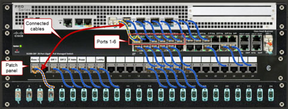

# Module 2: (Labs 2.9 - 2.14) - Supporting Cabling and Physical Installations 
### Lab 2.9: Explore Physical Connectivity 1
Complete this lab as follows:  
### View the current state of the first six ports on the Cisco switch and its accompany patch panel.  
Under Networking Closet, select Hardware.
Zoom in on the Cisco switch in the rack to view the power and network activity lights.  
Note: When a component's power light (the left light) is on, you know the device is plugged in and turned on.  
The network activity light (the right light) tells you which ports are connected to an active device. When this light is blinking, you know that network traffic is being transmitted through the port.  

From the top right, select Questions.  
Answer Questions 1-3.  
Minimize the Lab Questions window.  
### Determine which computers are plugged into ports 1 and 3.  
From the Cisco switch, select the wires plugged into ports 1 and 3.  
Look at the patch panel and find the cables accompanying port.  
From the top right, select Questions.  
Answer Question 4.  
Minimize the Lab Questions window.  
### From the ITAdmin workstation, ping each of the following computers using the IP addresses shown below:  
  
From the top left, select Floor 1 Overview.  
Under IT Administration, select ITAdmin.  
Right-click Start and then select Terminal (Admin).  
Type ping ip_address and then press Enter.  
Make a note as to whether the ping was successful or not.  
Repeat step 3d for each remaining IP address.  
Answer Question 5-6.  
Minimize the Lab Questions window.  
### From ITAdmin, check for network connectivity.
From the taskbar, right-click the Network icon and select Network and Internet settings.  
From the diagram at the top, you are informed that you have an Ethernet connection.  
Below the diagram, select Ethernet.  
You are shown details about your network connection.  
Close the Settings app.  
### From the hardware view of ITAdmin, check for network connectivity and activity by viewing the network card's link lights.
From the top left, select IT Administration to view the hardware of the computers in this office.  
Above the ITAdmin workstation (not the monitor), select Back. Notice that:  
&emsp;* The link light for the network card is illuminated, indicating a physical connection (link) between this workstation and the next device (the network switch).  
&emsp;* The network activity light is blinking, indicating that network traffic is being transmitted on this connection.  
&emsp;* These two lights match what you saw when viewing the cables connecting ITAdmin to the Cisco switch and the patch panel.  
### From the Exec operating system, check for network connectivity.
From the top left, select Floor 1 Overview.  
Under Executive Office, select Exec.  
Right-click Start and then select Settings.  
Select Network & internet.  
Under the Network & internet heading, you see that this computer is not connected to any networks.  
Close the Settings app.  
### From the hardware view of Exec, check for network connectivity and activity by viewing the network card's link lights.
From the top left, select Executive Office to view the hardware for the computers in this office.  
Above the Exec workstation (not the laptop), select Back.  
Zoom in on the Ethernet cable and examine its link lights.  
The link and network activity lights for the Ethernet port with a cable plugged in are not illuminated. This indicates there is no connection to the switch.  
Possible causes for no connectivity include:  
&emsp;* A faulty or disconnected cable  
&emsp;* A bad network card (NIC)  
&emsp;* A faulty or disabled switch port  
### From Exec, test the possibility of a bad NIC by dragging the network cable from the existing network card to the onboard port.
Drag the Ethernet cable from its existing location to the Ethernet onboard port.  
Answer Question 7.  
### From the Exec operating system, check for network connectivity.
On the Exec monitor, select Click to view Windows 11.  
Use the ping command to try to access the following computers:  
&emsp;* Right-click Start and then select Terminal (Admin).  
&emsp;* Type ping 192.168.0.10 (the CorpServer) and press Enter.  
&emsp;* Type ping 163.128.1.1 (the ISP) and press Enter.
&emsp;* Both pings are successful.  
Right-click Start and then select Settings.
Select Network & internet.  
Under the Network & internet heading, you see that this computer is now connected to the internet.  
Close the Settings app.  
### In the Networking Closet, check the link light status for Exec.
From the top left, select Floor 1 Overview.  
Under Networking Closet, select Hardware.  
Zoom in on the Cisco switch.  
The network activity lights on the switch (port 1) are blinking, indicating that the Exec computer has a connection and network activity.  
### From the hardware view of Office1, check for network connectivity.
From the top left, select Floor 1 Overview.  
Under Office 1, select Hardware.  
Above the workstation, select Back.  
The link and network activity lights are not illuminated, indicating that there is no connection to the switch.  
Possible causes for no connectivity include:  
&emsp;* A faulty or disconnected cable  
&emsp;* A bad network card (NIC)  
&emsp;* A faulty or disabled switch port  
### Test the network cable for Office1.
Unplug the existing Ethernet cable from the wall plate and from the back of the computer.  
From the Shelf, expand Cables.  
Select the Cat6a Cable, RJ45 (a known good cable).  
From the Selected Component pane:  
&emsp;* Drag one RJ45 Connector to the Ethernet port (red) in the wall plate.  
&emsp;* Drag the other RJ45 Connector to the Ethernet port in the computer.  
&emsp; The link and network activity lights on the NIC still don't show an active connection. Therefore, the cable in the office wasn't the problem.  
### From the wiring closet, test the network patch cable for Office1.
From the top left, select Floor 1 Overview.  
Under Networking Closet, select Hardware.  
Remove the existing patch cable from Off 1 (Office 1) and from port 3.  
From the Shelf, select the Cat6a Cable. RJ45.  
From the Selected Component pane:  
&emsp;* Drag one RJ45 Connector to the Off 1 port on the patch panel.  
&emsp;* Drag the other RJ45 Connector to the port 3 on the Cisco switch.  
&emsp; The link and network activity lights for port 3 indicate an active connection. The patch cable in the Network Closet was the problem.  
### From Office1, test the network connection to the following devices.
From the top left, select Floor 1 Overview.  
Under Office 1, select Office1.  
Right-click Start and then select Terminal (Admin).  
Ping the following devices:  
&emsp;* Office1: 192.168.0.30  
&emsp;* Exec: 192.168.0.34  
&emsp;* ISP: 163.128.1.1  
&emsp; You are now able to ping all devices verifying local and internet connectivity.  
(Optional)  
Look at the Network icon in the Notification area.  
The icon indicates a normal network connection.  
Right-click Start and then select Settings.  
Select Network & internet.  
Under Status, you see that this computer is now connected to the internet.  
Close the Settings app.  
## Lab 2.10: Explore Physical Connectivity 2
Complete this lab by following these steps in order:  
### Locate the three servers in the rack.
Notice that three servers are listed under Networking Closet:  
&emsp;* CorpData  
&emsp;* CorpiSCSI  
&emsp;* CorpServer  
Under Networking Closet, select Hardware to view the hardware in this room.  
Scroll right to view all of the monitors. Notice that each is connected to a server (see the name on the monitor) and is currently running.  
Click on each server in the rack. Notice the name of the server in the Selected Component pane.  
From the top right, select Questions.  
Answer Question 1.  
Minimize the Lab Questions dialog.  
### From the Networking Closet, disconnect all three power plugs from the wall outlet and view the results.
Remove the three AC Power connectors from the wall outlets.  
&emsp;* The right two connectors come from the rack mount UPSs.  
&emsp;* The left connector comes from the small desktop UPS.  
From the top right, select Questions.  
Answer Question 2.  
Minimize the Lab Questions dialog.  
### Find the power source for the CorpServer.
Above the rack, select Back.  
Select the power cable on the back of CorpServer.  
Notice where the other end is plugged in.  
From the top right, select Questions.  
Answer Question 3.  
Minimize the Lab Questions dialog.  
### Find the power source for the CorpServer monitor.
Above the CorpServer (first) monitor, select Back.  
Select the power cable on the back of the monitor.  
Notice where the other end is plugged in.  
From the top right, select Questions.  
Answer Question 4.  
Minimize the Lab Questions dialog.  
### From CorpData, ping Office1 and the CorpNet router's internal interface.
On the CorpData monitor, select Click to view Linux.  
From the favorites bar, select Terminal.  
At the terminal prompt, enter the following commands:  
&emsp;* Type ping -c4 192.168.0.30 (Office1) and press Enter.  
&emsp;* Type ping -c4 198.28.56.1 (CorpNet Router's internal interface) and press Enter.  
&emsp; Note: The -c4 option limits the number of echo requests sent by the ping utility to four.  
From the top right, select Questions.  
Answer Question 5.  
Minimize the Lab Questions dialog.  
Close the Terminal window.  
### From the Networking Closet, move the male power connector for the switch from the non-critical load bank section to the critical load bank section.
From the top left, select Networking Closet.  
Move the AC Power Connector (Male), connected to the switch and UPS, from the UPS non-critical load bank (on the left) to the critical load bank (on the right).  
&emsp; Note: To identify the correct male AC Power Connector, select the power cable connected to the back of the switch (top); the other end of the cable will be outlined in the non-critical load bank section.  
### From the Networking Closet, switch to the Front view of the rack and observe any changes caused by moving the plug.
Above the rack, select Front.  
View the link and network activity lights.  
&emsp; The switch is now receiving power from the UPS battery and there are network activity lights.  
### Notice that power has not been restored to the CorpiSCSI monitor.
From CorpData, test network connectivity.  
On the CorpData monitor, select Click to view Linux.  
From the Terminal, ping the following devices:  
&emsp;* Type ping -c4 192.168.0.30 (Office1) and press Enter.  
&emsp;* Type ping -c4 198.28.56.1 (CorpNet Router's internal interface) and press Enter.  
&emsp;* Type ping -c4 163.128.80.93 (DNS) and press Enter.  
From the top right, select Questions.  
Answer Question 6.  
Minimize the Lab Questions dialog.  
### From the Networking Closet, reconnect the AC power cord from the UPSs back to the wall outlet.
From the top left, select Networking Closet.  
Under Partial Connections, select the AC Power Cable.  
From the Selected Component pane, drag the AC Power Connector (Male) connector to the wall plate.  
Repeat steps a and b for the second UPS power cable.  
Select the small UPS.  
From the Selected Component pane, drag the AC Power Connector (Male) connector to the wall plate.  
With these servers now receiving power from the wall plate, they can now be accessed.  
Select the power button on the CorpServer server.  
Return to the Networking Closet.  
Select the power button on the CorpiSCSI monitor.  
## Lab 2.11: Troubleshoot Physical Connectivity 1
Explanation  
While completing this lab, use the following information:  
  
Complete this lab as follows:  
### From the Office1 computer, use the ping command to begin troubleshooting the connectivity problem.
Under Office 1, select Office1.  
Right-click Start and then select Terminal (Admin).  
From the PowerShell prompt, type ping workstation and then press Enter.  
Repeat step 1c for the remaining workstations.  
Notice that all the pings are successful except the ping to Office2 (192.168.0.31).  
From the Office2 computer, use the ping command to further troubleshoot the connectivity problem.  
From the top left, select Floor 1 Overview.  
### Under Office 2, select Office2.
Right-click Start and then select Terminal (Admin).  
From the PowerShell prompt, type ping workstation and then press Enter.  
Repeat step 2d for the remaining workstations.  
Notice that all the pings fail except to itself (192.168.0.31).  
### From Office2, check for a connection to the internet.
Right-click Start, and select Settings.  
Select Network & Internet.  
Notice that the diagram on the Status pane shows no connection to a network.  
Close the Settings dialog.  
### Check for a network connection by viewing the NIC port of the Office2 computer.
From the top left, select Office 2 to view the hardware in this office.  
Above the Office2 workstation, select Back to see the back of the computer tower.
The link and status lights on the NIC port are not blinking, indicating no connection to the network. This can be due to:  
&emsp;* A bad NIC
&emsp;* A faulty cable (easy to test)
&emsp;* An unplugged cable (easy to test)
&emsp;* A turned-off or faulty switch or hub port
Confirm that the network cable is connected to the NIC and the wall plate by selecting the cable plugged into the NIC.  
Notice that both ends of the cable are connected correctly. This means that the Ethernet cable could be faulty.
### Replace the network cable from Office2 and the wall.
Select the network cable plugged into Office2 and drag it to the shelf.  
Drag the RJ45 cable from the wall plug to the shelf.  
Under Shelf, select Cat6a Cable, RJ45.  
From the Selected Component pane:  
&emsp;* Drag an RJ45 Connector to the network wall plug.    
&emsp;* Drag the unconnected RJ45 Connector to the NIC on the back of the Office2 computer.
&emsp; Notice that the link and status lights for the connection are not green and active. This means that the cable may not have been bad. It's time to check for issues in the Networking Closet.  
### From the Networking Closet, check the switch to ensure that it's powered on.
From the top left, select Floor 1 Overview.  
Under Networking Closet, select Hardware.  
&emsp; Notice that the system light for the switch indicates that it is powered on.  
Observe the activity lights for all ports on the switch.  
&emsp; Notice that there is no activity for Port 4. Possible causes include:  
&emsp;* The cable between Office 2's patch panel port and the switch is bad or disconnected.  
&emsp;* Port 4 on the switch is disabled or shut down.
### Verify that the network cable is connected to Office2's patch panel port and the switch.
Select Port 4 on the switch.  
&emsp; Notice that it shows the cable is also plugged into the patch panel. This may mean that this cable is faulty.  
### Replace the patch panel cable for Office2 to the switch.
Select the cable plugged into Port 4 and drag it to the workspace.  
From the patch panel, drag the cable plugged into Off 2 to the workspace.  
Under Shelf, select Cat6a Cable, RJ45.  
From the Selected Component pane:  
&emsp;* Drag an RJ45 Connector to Port 4 on the switch.  
&emsp;* Drag the unconnected RJ45 Connector to the patch panel port for Off 2 (Office 2).  
&emsp; Notice that the link and status lights for Port 4 are now green and active.  
### From Office 2, check for a network connection.  
From the top left, select Floor 1 Overview.  
Under Office 2, select Hardware.  
Check for an active link light on the network card of the computer.  
The light is blinking, indicating a network connection.  
On the Office2 monitor, select Click to view Windows 11.  
Right-click Start and select Settings.  
Select Network & Internet.  
The diagram in Status page shows a connection to the network and internet.  
(Optional) Ping each workstation in the network.  
Each ping attempt now succeeds.  
### From Office 1, use the ping command to verify connectivity to Office 2.
From the top left, select Floor 1 Overview.  
Under Office 1, select Office1.  
From the PowerShell prompt, type ping Office2 and then press Enter.  
Notice that the ping to Office 2 succeeds. The problem is resolved.  
&emsp; Replacing the NIC in Office 2 and making a console connection to the switch to confirm if port 2 is disabled are two viable approaches to this problem. Yet, as indicated earlier, you should look for common errors or solutions that you can test quickly. Think about and check cables, power, and connectivity first when troubleshooting.  
## Lab 2.12: Troubleshoot Physical Connectivity 2
While completing this lab, use the following information:  
  
Complete this lab as follows:  
### From the IT Administration office, ping each workstation on the network.
Under IT Administration, select ITAdmin.  
Right-click Start and select Terminal (Admin).  
From the PowerShell prompt, type ping [workstation's IP] and then press Enter.  
&emsp; Notice that all the pings are successful except the one to Office2. This verifies that there is connectivity between all other workstations on the network except Office2. This indicates that the scope of the problem is probably limited to Office2. Because the scope of the problem is currently limited to Office2, you should look for common errors or solutions that you can test quickly.  
### Confirm that the network cable is connected to the NIC and the wall plate.
From the top left, select Floor 1 Overview.  
Under Office 2, select Hardware to view the hardware in Office 2.  
Above the Office2 desktop computer system, select Back to view the back of the computer.
Notice that an Ethernet cable is plugged into the network card in the computer.  
Select the Ethernet RJ45 shielded cable that is plugged into the computer.  
Scroll to the right and view the Ethernet wall plate.  
Notice that the cable in the computer is plugged into the Ethernet port on the wall plate.  
Scroll back to the computer and check for activity lights for the network port.  
Notice that no lights are blinking. This indicates that there is no connection to the network.  
### From Office2, replace the cable between the workstation and the wall plate.
Drag the Ethernet cable from the back of the computer and place it on the workspace.  
Drag the Ethernet cable from the wall plate and place it on the workspace.  
Under Shelf, expand Cables.  
Select Cat6a Cable, RJ45.  
From the Selected Component pane:  
&emsp;* Drag an RJ45 Shielded Connector to the Ethernet port on the computer.  
&emsp;* Drag the unconnected RJ45 Shielded Connector to the Ethernet port on the wall plate.  
&emsp; The lights for the network card are still not active. You could replace the NIC in Office2, but replacing cables is quicker.  
### From the Networking Closet, check the switch to ensure it is powered on.
From the top left, select Floor 1 Overview.  
Under Networking Closet, select Hardware.  
&emsp; Notice that the power light for the Cisco switch indicates that it is powered on. Also, since the workstation in the IT Administration office can communicate through the switch, so you know that the device is not turned off, and is functioning properly.  
### From the Networking Closet, observe the activity lights for all ports and check for cable connections.
Zoom in on the switch ports.  
&emsp; Notice that there are activity lights for other ports, yet there is a lack of activity for port 4.  
&emsp; Possible causes include:  
&emsp;* The cable between Office 2's patch panel port and the switch is bad or disconnected.  
&emsp;* Port 4 on the switch is disabled or shut down.  
Select the cable plugged into Off 2.  
&emsp; Notice that the other end of the cable (which is highlighted) is plugged into port 4.  
### From the Networking Closet, replace the patch panel cable.
Drag the Ethernet cable from Off 2 and place it on the workspace.  
Drag the Ethernet cable from port 4 and place it on the workspace.  
Under Shelf, expand Cables.  
Select Cat6a Cable, RJ45.  
From the Selected Component pane:  
&emsp;* Drag an RJ45 Shielded Connector to Off 2.  
&emsp;* Drag the unconnected RJ45 Shielded Connector to port 4.  
The activity light for port 4 still does not indicate network activity.  
&emsp; Making a console connection to the switch to confirm that port 4 is enabled is a viable approach to this problem, but the lab does not provide a console application to confirm the switch's port settings.  
### From Office 2, add a known good spare NIC to the Office2 computer and connect the Ethernet cable to the new card.
From the top left, select Floor 1 Overview.  
Under Office 2, select Hardware.  
Above the computer, select Front.  
Select the power button to turn the computer off.  
Above the computer, select Motherboard to open the case.  
Under Shelf, expand Network Adapters.  
Drag Network adapter, Ethernet 1000BaseTX, PCIe to the PCIe slot on the motherboard.  
Above the computer, select Back to replace the case.  
Drag the Ethernet cable from its existing NIC to the new NIC just added.  
### Power on the Office2 computer and test connectivity to the network.
Above the computer, select Front.  
Select the power button to turn the computer on.  
Right-click Start and then select Terminal (Admin).  
At the PowerShell prompt, type ipconfig.  
Notice that Office2 received a new/different IP address from the DHCP server because the new NIC makes it look like a different computer.  
From the PowerShell prompt, type ping [workstation's IP] and then press Enter.  
Repeat step 8e for each remaining computer.  
All pings are now successful.  
## Lab 2.13: Troubleshoot Physical Connectivity 3
While completing this lab, use the following information:  
  
Complete this lab as follows:  
### From Exec, use the ping command to begin troubleshooting the connectivity problem.
Under Executive Office, select Exec.  
Right-click Start and then select Terminal (Admin).  
From the PowerShell prompt, type ping workstation IP address and then press Enter.  
Repeat step 1c for the remaining workstations.  
Notice that all the pings fail except to itself (192.168.0.34).  
### From Support, repeat the same troubleshooting steps used in the Executive Office to further discover the scope of the problem.
From the top left, select Floor 1 Overview.  
Under Support Office, select Support.  
From the Favorites bar, select Terminal.  
From the terminal prompt, type ping workstation IP address and then press Enter.  
If needed, press Ctrl + C to stop the pinging process.  
&emsp; Notice that all the pings fail except the ping to itself (192.168.0.32).  
With matching results from both computers, the problem is most likely shared with the other workstations.  
&emsp; Because the scope of the problem includes two offices, you should look for common errors or solutions that you can test quickly.  
### From Exec, check for a connection to the network.
From the top left, select Floor 1 Overview.  
Under Executive Office, select Exec.  
Right-click Start and select Settings.  
Select Network & internet.  
Notice that the diagram on the Status pane shows that the network connection is not connected to a network.  
Close the Settings dialog.  
### Check for a network connection by viewing the computer's NIC port.
From the top left, select Executive Office to view the hardware in this office.  
Above the Exec workstation, select Back to see the back of the computer tower.  
Notice that the link and status lights on the NIC port are not blinking, indicating no connection to the network. This can be due to:  
&emsp;* A bad NIC  
&emsp;* A faulty cable (easy to test)  
&emsp;* An unplugged cable (easy to test)  
&emsp;* A turned off or faulty switch or hub port  
### Replace the network cable from Exec and the wall.
Select the cable plugged into Exec and drag it to the shelf.  
Drag the RJ45 cable from the wall plate to the shelf.  
Under Shelf, select Cat6a Cable, RJ45.  
From the Selected Component pane:  
&emsp;* Drag an RJ45 Connector to the network wall plate.  
&emsp;* Drag the unconnected RJ45 Connector to the NIC on the back of the Exec computer.  
&emsp; Notice that the link and status lights for the connection are still not green and active. This means that the cable may not have been bad. It's time to check for issues in the Networking Closet.  
### From the Networking Closet, check the switch to ensure that it's powered on.
From the top left, select Floor 1 Overview.  
Under Networking Closet, select Hardware.  
&emsp; Notice that the system light for the switch indicates that it is powered off. In addition, since the workstations in the Support Office and the Executive Office could not successfully ping the network, you can conclude that the device is turned off.  
Check to see if the switch has power.  
Above the rack, select Back to switch to the back view of the rack.  
Select the switch's power cable and verify that it is plugged into the UPS.  
&emsp; Notice that the switch is plugged into the UPS, but it is not plugged into the critical load section. This means that if the main power goes off, the switch loses power as well.  
Move the switch's power cable from the non-critical load (Bank 2) outlet to the empty critical load (Bank 1) outlet.  
Notice that the Ethernet cables plugged into the server have link status lights that indicate they have power and a connection.  
Above the rack, select Front to switch to the front view of the rack.  
Observe the power light and activity lights for all ports on the switch.  
&emsp; The lights are all on and active (except for the wireless access point, as it is still connected to the non-critical load (Bank 2) on the UPS).  
### From the Executive Office, check for a network connection.
From the top left, select Floor 1 Overview.  
Under Executive Office, select Hardware.  
Check for an active light on the computer's network card.  
The light is blinking, indicating a network connection.  
On the Exec monitor, select Click to view Windows 11.  
Right-click Start and select Settings.  
Select Network & internet.  
The diagram in Status page shows a connection to the network and internet.  
(Optional) Ping each workstation on the network using their IP address.  
Each ping attempt now succeeds.  
## Lab 2.14: Troubleshoot Physical Connectivity 4
Complete this lab as follows:  
### From the Office 1 computer, use the ping command to begin troubleshooting the connectivity problem.
Under Office 1, select Office1.  
Right-click Start and then select Terminal (Admin).  
From the PowerShell prompt, ping the following computers:  
&emsp;* CorpServer: Type ping 192.168.0.10 and then press Enter.  
&emsp;* Office2: Type ping 192.168.0.31 and then press Enter.  
&emsp;* ITAdmin: Type ping 192.168.0.33 and then press Enter.  
&emsp; Notice that all the pings fail.  
### Check for a connection to the internet using the Settings app.
Right-click Start and then select Settings.  
Select Network & Internet.  
&emsp; Notice that the diagram on the Status pane shows that the computer is not connected to a network.  
Close the Settings dialog.  
### Check for a network connection by viewing the NIC port of the Office1 computer.
From the top left, select Office 1 to view the hardware in this office.  
Above the Office1 workstation, select Back to see the back of the computer.  
&emsp; Notice that there is no Ethernet cable attached to the computer. However, there is an Ethernet cable plugged into the wall plate. The cable could have been accidentally disconnected from the computer when the user added the speakers.  
### Connect the network cable from the wall outlet to Office1.
Select the Ethernet cable plugged into the wall plate.  
From the Selected Component pane, drag the unconnected RJ45 Shielded Connector to the NIC on the back of the Office1 computer.  
&emsp; Notice that the status and link lights on the NIC are green and active.  
### Check for network connectivity from Office1.
On the Office1 monitor, select Click to view Windows 11.  
Right-click Start and select Settings.  
Select Network & Internet.  
T&emsp; he diagram on the Status page shows a connection to the network and internet.  
(Optional) Ping each workstation on the network.  
Each ping attempt now succeeds.  