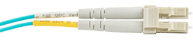
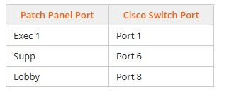
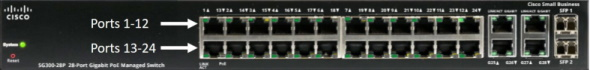
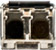
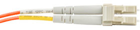
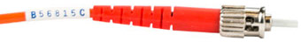
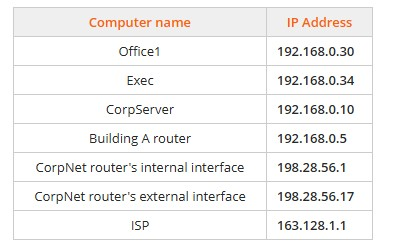

# Module 2: Supporting Cabling and Physical Installations
## Lab 2.1 : Reconnect to an Ethernet Network
Complete this lab as follows:  

### Add the 1000Base TX adapter to the Office 2 computer.
Above the computer, select Motherboard to switch to the motherboard view of the computer.  
Under Shelf, expand Network Adapters.  
Identify the network adapter that has the fastest Ethernet speed.  
Under Shelf, drag the Network adapter, Ethernet 1000BaseTX, PCIe network adapter to a free PCIe slot on the computer.  
### Connect the computer to the network.
Above the computer, select Back to switch to the back view of the computer.  
Drag the RJ45 Shielded Connector from the motherboard's NIC to the port of the 1000BaseTX network adapter.  
### Verify the connection to the local network and the internet.  
Above the computer, select Front to switch to the front view of the computer.  
Select the power button on the computer case.  
Wait for the operating system to start.  
Right-click Start and then select Settings.  
Select Network & Internet.  
The diagram should indicate an active connection.  
### Lab 2.2: Connect to an Ethernet Network
Complete this lab as follows:  
### Access the back view of the computer in Office 1.
Under Office 1, select Hardware.  
Above the computer, select Back to switch to the back view of the computer.  
### Connect the RJ45 cable to the computer and the wall plate.
Under Shelf, expand Cables.  
Select the Cat6a Cable, RJ45 cable.  
From the Selected Component window:  
Drag an RJ45 Shielded Connector to the Ethernet port on the computer.  
Drag the other RJ45 Shielded Connector to the Ethernet port on the wall outlet.  
### Test the connection to the internet.
On the computer monitor, select Click to view Windows 11 to view the running operating system.  
Right-click Start and then select Settings.
Select Network & internet  
The diagram should indicate an active connection.  
### Lab 2.3: Connect a Cable Modem
Complete this lab as follows:  
### Add the cable modem to the workspace.
Under Shelf, expand Routers.  
Drag the Cable Modem/Router from the shelf to the workspace.  
Select Back to switch to the back view of the cable modem.  
### Connect the modem to the WAN connection.
Under Shelf, expand the Cables category.  
Select the Coaxial Cable, RG-6 cable.  
From the Selected Component pane:  
&emsp;* Drag a Coaxial Type F connector to the applicable port on the cable modem.  
&emsp;* Drag the other Coaxial Type F connector to the applicable port on the wall plate.  
### Connect the computer to the cable modem.
Over the computer, select Back to switch to the back view of the computer.  
Under Shelf, select the Cat6a Cable, RJ45 cable.  
From the Selected Component pane:  
&emsp;* Drag an RJ45 Shielded Connector to the Ethernet port on the cable modem.  
&emsp;* Drag the other RJ45 Shielded Connector to the Ethernet port on the computer (not the Ethernet card in the slot).  
### Provide power to the modem.
Under Shelf, select the Power Adapter, AC to DC.  
From the Selected Component pane:  
&emsp;* Drag the DC Power Connector to the port on the cable modem.  
&emsp;* Drag the AC Power Adapter end to the power outlet.  
### Verify that the computer is connected to the internet.
On the monitor, select Click to view Windows 11.  
From the notification area, right-click the Network icon and select Network and Internet settings.  
### Lab 2.4: Explore Multiple Locations in a Lab
Complete this lab as follows:  
### For safety, power off the Office 2 computer and unplug the computer from the power source before working with internal components.
Under Office 2, select Hardware to view the hardware for this office.  
On the computer, select the power button to turn the computer off.
Select Back to switch to the back view of the computer.  
Unplug the AC power cable.  
### Install the PCIe network adapter in the Office 2 computer's free PCIe (x1) slot.
Above the computer, select Motherboard to switch to the motherboard view of the computer.  
Under Shelf, expand Network Adapters.  
Drag the PCIe Network Adapter to the applicable free PCIe (x1) slot on the motherboard.  
Select Back to switch to the back view of the computer.  
Reconnect the AC power cable.  
### Connect an Ethernet cable to the network card in the computer and to the wall plate.
Ensure you are using the Back view of the Office 2 computer.  
Under Shelf, expand Cables.  
Select the Networking Cable.  
From the Selected Component pane:  
&emsp;* Drag an RJ45 Connector to the built-in port or the port on the PCIe network card.  
&emsp;* Drag the unconnected RJ45 Connector to the network port on the wall plate (the left port).  
### Turn the computer on and test for network and internet connectivity.
Above the computer, select Front.  
Select the power button on the computer.  
The computer startup process begins and you are automatically logged into Windows.  
Right-click Start and select Settings to open the Microsoft Settings app.  
Select Network & Internet.  
Notice that in the Status pane, the image shown indicates a connection to the network.  
### Test to see if the uninterruptable power supply is functioning properly in the networking closet.
From the top left navigation tabs, select Floor 1.  
Under Networking Closet, select Hardware.    
From the wall outlets, unplug the AC power connectors (Male) by dragging them to the side.
Notice that the power and activity lights on the rack-mounted networking devices are still flickering (zoom in if necessary). Also notice that the monitors are still on.  
## Lab 2.5: Connect Network Devices
While completing this lab, use the following information:  
SC connectors have square connectors that are pushed in to connect.  
  
LC connectors have both connectors linked together.  
  
Complete this lab as follows:  
### Install the SFP Transceiver (LC) in the networking closet on Floor 1.
Under Shelf, expand the Adapters.  
Drag the SFP Transceiver (LC) to the SFP 2 port on the switch.  
### Connect the fiber cable to the switch.
Under Shelf, expand Cables.  
Select Cable, Fiber, SC to LC.  
From the Selected Component pane:  
&emsp;* Drag Connector, Fiber, Duplex LC Multi-mode, Male to the SFP LC port (plugged into SFP2) on the switch.  
&emsp;* Drag the Fiber Optic SC Connector (A) to port 3 on the fiber patch panel.  
&emsp;* Drag the Fiber Optic SC Connector (B) to port 4 on the fiber patch panel.  
### Access the networking closet on floor 2.
From the top left, select Floor 1.  
Under Building A, select Floor 2.  
Under Networking Closet 2, select Hardware.  
### Connect the fiber cable to switches on Floor 2.
Under Shelf, expand Adapters.  
Drag SFP Transceiver (LC) to an open SFP port on the switch.  
Under Shelf, expand Cables.  
Select Cable, Fiber, SC to LC.  
From the Selected Component pane:  
&emsp;* Drag the Connector, Fiber, Duplex LC, Multi-mode, Male to the SFP port.  
&emsp;* Drag the Fiber Optic SC Connector (A) to port 1 on the fiber patch panel.  
&emsp;* Drag the Fiber Optic SC Connector (B) to port 2 on the fiber patch panel.  
###Plug the switch on Floor 2 into a bank 1 critical load outlet on the UPS.  
Above the rack, select Back to switch to the back view of the rack.  
Under Shelf, select AC Power Cable.  
From the Select Connector pane:  
&emsp;* Drag AC Power Connector (Female) to the AC port on the back of the switch.  
&emsp;* Drag the AC Power Connector (Male) to an open bank 1 critical load outlet.
Above the rack, select Front to switch to the front view and confirm that the network switch has power.
### Verify that there is an internet connection for any Floor 2 computer.
From the top left, select Floor 2.
Select any of the computers on Floor 2.  
Right-click Start and then select Settings.
Select Network & Internet.  
The image shown should indicate a connection to the internet.  
## Lab 2.6: Connect Patch Panel Cables 1
Complete this lab as follows:  
### From the Networking Closet, connect the patch panel and switch.
Under Shelf, expand Cables.  
Select the Cat6a Cable, RJ45 cable.  
From the Selected Component pane:  
Drag an RJ45 Shielded Connector to the Off 1 (Office 1) port on the patch panel.  
Drag the other RJ45 Shielded Connector to port 3 on the Cisco switch (top row, third port from the left).  
### Connect the Office1 workstation to the local area network.
From the top left, select Floor 1 Overview.  
In Office 1, select Hardware.  
Above the computer, select Back to switch to the back view of the computer.  
Under Shelf, expand Cables.  
Select Cat6a Cable, RJ45.  
From the Selected Component pane:  
&emsp;* Drag an RJ45 Shielded Connector to the Ethernet port on the computer.  
&emsp;* Drag the other RJ45 Shielded Connector to the open Ethernet port on the wall outlet.  
### Configure the workstation to obtain IP and DNS addresses automatically from the server on the network.
On the Office1 monitor, select Click to view Windows 11.  
From the Windows taskbar, right-click Start and then select Settings.  
Select Network & internet.  
Select Ethernet and then next to IP assignment, select Edit.  
Change the Edit IP settings drop-down to Automatic (DHCP), then click Save.  
At the top of the Settings dialog, select Network & internet.  
The globe icon next to the word Connected indicates the machine is now connected to the network and can access the internet.  
## Lab 2.7: Connect Patch Panel Cables 2
While completing this lab, use the following port information.  
   
Complete this lab as follows:  
### From the Networking Closet, attach an Ethernet cable from the patch panel to the switch port.
Under Shelf, expand Cables.  
Select the Cat6a Cable, RJ45.  
From the Selected Component pane:  
&emsp;* Drag an RJ45 Shielded Connector to the Exec 1 port on the patch panel.  
&emsp;* Drag the other RJ45 Shielded Connector to the correct port on the Cisco switch (top row).  
   
### Repeat steps 1b-1c for the Supp and Lobby ports.
### Lab 2.8: Connect Fiber Optic Cables
To determine which network components to use, examine the ports on the switch and the CorpiSCSI server.   
The SFP module installed in the switch uses LC connectors.   
   
The fiber optic NIC installed in the CorpiSCSI server uses ST connectors.   
    
The ST to LC fiber cable is the only cable that can be used to connect the switch and the server.   
LC connectors have two connectors linked together. LC connectors can only be inserted one way.   
    
ST connectors twist on using a BNC connector. An ST cable has two color-coded ST connectors. They have one for transmit (Tx) and one for receive (Rx).   
   
    
### Complete this lab as follows:
Connect the fiber ST to LC cable to the SFP port.   
Under Shelf, expand Cables.   
Drag the Cable, Fiber, ST to LC cable to the SFP 1 LC port on the switch.   
In the Select Connector window, select the Connector, Fiber, Duplex LC, Multi-mode, Male.   
### Connect the fiber ST to LC cable to the TX and RX ports.
Above the rack, select Back to switch to the back view.   
From the Selected Component pane:
&emsp;* Drag the ST Connector (A) to the TX port on the CorpiSCSI server (the bottom server).   
&emsp;* Drag the ST Connector (B) to the RX port on the CorpiSCSI server.   
### Disconnect the Cat6a RJ45 cable from the CorpiSCSI server and switch.
Drag the RJ45 connector from the back of the server to the Shelf.
Above the rack, select Front to view the front of the rack.   
Drag the highlighted RJ45 connector from the switch to the Shelf.   
### Verify that the CorpiSCSI server is connected to the network.
On the CorpiSCSI's monitor, select Click to view Windows Server 2019.   
Right-click Start and select Settings.   
Select Network & Internet.   
Verify that Ethernet 3 is connected to CorpNet.local.   
### Lab 2.9: Explore Physical Connectivity 1
Complete this lab as follows:  
### View the current state of the first six ports on the Cisco switch and its accompany patch panel.
Under Networking Closet, select Hardware.  
Zoom in on the Cisco switch in the rack to view the power and network activity lights.  
Note: When a component's power light (the left light) is on, you know the device is plugged in and turned on.  
The network activity light (the right light) tells you which ports are connected to an active device. When this light is blinking, you know that network traffic is being transmitted through the port.  
  
From the top right, select Questions.  
Answer Questions 1-3.  
Minimize the Lab Questions window.  
### Determine which computers are plugged into ports 1 and 3.
From the Cisco switch, select the wires plugged into ports 1 and 3.  
Look at the patch panel and find the cables accompanying port.  
From the top right, select Questions.  
Answer Question 4.  
Minimize the Lab Questions window.  
### From the ITAdmin workstation, ping each of the following computers using the IP addresses shown below:
  
From the top left, select Floor 1 Overview.  
Under IT Administration, select ITAdmin.  
Right-click Start and then select Terminal (Admin).  
Type ping ip_address and then press Enter.  
Make a note as to whether the ping was successful or not.  
Repeat step 3d for each remaining IP address.  
Answer Question 5-6.  
Minimize the Lab Questions window.  
### From ITAdmin, check for network connectivity.
From the taskbar, right-click the Network icon and select Network and Internet settings.  
From the diagram at the top, you are informed that you have an Ethernet connection.  
Below the diagram, select Ethernet.  
You are shown details about your network connection.  
Close the Settings app.  
### From the hardware view of ITAdmin, check for network connectivity and activity by viewing the network card's link lights.
From the top left, select IT Administration to view the hardware of the computers in this office.  
Above the ITAdmin workstation (not the monitor), select Back. Notice that:  
&emsp;* The link light for the network card is illuminated, indicating a physical connection (link) between this workstation and the next device (the network switch).  
&emsp;* The network activity light is blinking, indicating that network traffic is being transmitted on this connection.  
&emsp;* These two lights match what you saw when viewing the cables connecting ITAdmin to the Cisco switch and the patch panel.  
### From the Exec operating system, check for network connectivity.
From the top left, select Floor 1 Overview.  
Under Executive Office, select Exec.  
Right-click Start and then select Settings.  
Select Network & internet.  
Under the Network & internet heading, you see that this computer is not connected to any networks.  
Close the Settings app.  
### From the hardware view of Exec, check for network connectivity and activity by viewing the network card's link lights.
From the top left, select Executive Office to view the hardware for the computers in this office.  
Above the Exec workstation (not the laptop), select Back.  r>
Zoom in on the Ethernet cable and examine its link lights.  
The link and network activity lights for the Ethernet port with a cable plugged in are not illuminated. This indicates there is no connection to the switch.  
Possible causes for no connectivity include:  
&emsp;* A faulty or disconnected cable  
&emsp;* A bad network card (NIC)  
&emsp;* A faulty or disabled switch port  
### From Exec, test the possibility of a bad NIC by dragging the network cable from the existing network card to the onboard port.
Drag the Ethernet cable from its existing location to the Ethernet onboard port.  
Answer Question 7.  
### From the Exec operating system, check for network connectivity.
On the Exec monitor, select Click to view Windows 11.  
Use the ping command to try to access the following computers:  
&emsp;* Right-click Start and then select Terminal (Admin).  
&emsp;* Type ping 192.168.0.10 (the CorpServer) and press   Enter.  
&emsp;* Type ping 163.128.1.1 (the ISP) and press Enter.
&emsp;* Both pings are successful.  
Right-click Start and then select Settings.  
Select Network & internet.  
Under the Network & internet heading, you see that this computer is now connected to the internet.  
Close the Settings app.  
### In the Networking Closet, check the link light status for Exec.
From the top left, select Floor 1 Overview.  
Under Networking Closet, select Hardware.  
Zoom in on the Cisco switch.  
The network activity lights on the switch (port 1) are blinking, indicating that the Exec computer has a connection and network activity.  
From the hardware view of Office1, check for network connectivity.  
From the top left, select Floor 1 Overview.  
Under Office 1, select Hardware.  
Above the workstation, select Back.  
The link and network activity lights are not illuminated, indicating that there is no connection to the switch.  
Possible causes for no connectivity include:  
&emsp;* A faulty or disconnected cable  
&emsp;* A bad network card (NIC)  
&emsp;* A faulty or disabled switch port  
### Test the network cable for Office1.
Unplug the existing Ethernet cable from the wall plate and from the back of the computer.  
From the Shelf, expand Cables.  
Select the Cat6a Cable, RJ45 (a known good cable).  
From the Selected Component pane:  
&emsp;* Drag one RJ45 Connector to the Ethernet port (red) in the wall plate.  
&emsp;* Drag the other RJ45 Connector to the Ethernet port in the computer.  
&emsp; The link and network activity lights on the NIC still don't show an active connection. Therefore, the cable in the office wasn't the problem.  
### From the wiring closet, test the network patch cable for Office1.
From the top left, select Floor 1 Overview.  
Under Networking Closet, select Hardware.  
Remove the existing patch cable from Off 1 (Office 1) and from port 3.  
From the Shelf, select the Cat6a Cable. RJ45.  
From the Selected Component pane:  
Drag one RJ45 Connector to the Off 1 port on the patch panel.  
Drag the other RJ45 Connector to the port 3 on the Cisco switch.  
The link and network activity lights for port 3 indicate an active connection. The patch cable in the Network Closet was the problem.  
### From Office1, test the network connection to the following devices.
From the top left, select Floor 1 Overview.  
Under Office 1, select Office1.  
Right-click Start and then select Terminal (Admin).  
Ping the following devices:  
&emsp;* Office1: 192.168.0.30  
&emsp;* Exec: 192.168.0.34  
&emsp;* ISP: 163.128.1.1  
&emsp;You are now able to ping all devices verifying local and internet connectivity.  
(Optional)  
Look at the Network icon in the Notification area.  
&emsp;* The icon indicates a normal network connection.  
&emsp;* Right-click Start and then select Settings.  
&emsp;* Select Network & internet.  
&emsp;* Under Status, you see that this computer is now connected to the internet.  
&emsp;* Close the Settings app.  