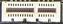

# Module 3 Configuring Interfaces and Switches

## Lab 3.1: Select and Install a Network Adapter
Complete this lab as follows:  
### Insert the PCI adapter into the motherboard.
Above the computer, select Motherboard to switch to the motherboard view of the computer.  
Under Shelf, expand Network Adapters.  
Drag the Network Adapter, Ethernet 10/100/1000BaseTX, PCIe card to a free PCIe slot on the computer's motherboard.  
  
### Move the Ethernet cable from the computer's built-in network adapter to the new PCIe network card.
Above the computer, select Back to switch to the back view of the computer.  
Drag the Ethernet cable from the built-in port to the port on the PCIe network adapter.  
### Confirm that the computer is connected to the local network and the internet.
Above the computer, select Front to switch to the front view of the computer.  
Select the power button on the computer case to turn on the computer.  
Wait for the operating system to load.  
Right-click Start and then select Terminal (Admin).  
From the PowerShell prompt, type ping 192.168.0.10 and then press Enter to test connectivity to the local network server.  
From the PowerShell prompt, type ping 198.28.2.254 and then press Enter to test connectivity to the internet.  
## Lab 3.2: Connect a Media Converter
Complete this lab as follows:  
### Add the media converter to the rack.
Under Shelf, expand Networking Devices.  
Drag the Media Converter to the bottom shelf of the rack in the Workspace.  
### Connect the SC to LC fiber cable to the media converter.
Above the rack, select Back to switch to the back view of the rack.  
Drag the Ethernet cable from the left wall outlet to the Ethernet port on the media converter.  
Under Shelf, expand Cables.  
Select the Cable, Fiber, SC to LC cable.  
From the Selected Component pane, drag the Connector, Fiber Duplex LC male connector to the media converter.  
### Connect the SC to LC cables to the patch panel.
Above the rack, select Front to switch to the front view of the rack.  
From the Selected Component pane:  
&emsp;* Drag the Fiber Optic SC Connector (A) to port 23 on the fiber patch panel.  
&emsp;* Drag the Fiber Optic SC Connector (B) to port 24 on the fiber patch panel.  
### Connect the power adapter to the media converter, and then plug it into a critical load bank outlet on the UPS using the adapter on the shelf.
From the Shelf, drag the Power Adapter, AC to DC to the DC power port on the media converter.  
From the Select Connector pane, select DC Power Connector.  
Above the rack, select Back to switch to the back view of the rack.  
Under Shelf, expand Adapters.  
Drag the C14 Power Adapter to an open critical load bank outlet on the rack UPS  
Under Partial Connections, select the Power Adapter, AC to DC.  
From the Selected Component pane, drag the AC Power Adapter to the C14 Power Adapter installed in the UPS.  
The lights on the media converter should turn on.  
### Navigate to any workstation on Floor 1 to confirm internet connectivity.
From the top left, select Building A.  
Under Building A, select Floor 1.  
Select a workstation (such as Office1).  
From the notification area, right-click the Network icon and select Open Network & Internet settings.  
Verify that the workstation has internet connectivity.
## Lab 3.3: Install a Switch in the Rack
Complete this lab as follows:  
### Add the new network switch to the rack.
Under Shelf, expand Switches.  
Drag the Switch to the space available at the top of the rack under the router.  
### Connect the power adapter to the switch, and then plug it into a critical load bank outlet using the AC Power Cable with C14 end.
Above the rack, select Back to switch to the back view of the rack.  
Under Shelf, expand Cables.  
Select the AC Power Cable with C14 end.  
From the Selected Component pane, drag the AC Power Connector to the switch and the AC Power Connector C14 to a critical load bank outlet on the UPS.  
### Connect port 5 on the switch to ITAdmin port 5 on the Patch Panel.  
Under Shelf, expand Cables.  
Drag a Cat6a Cable to port 5 on the switch.  
From the Selected Component pane, drag the unconnected RJ45 Shielded Connector to port 5 on the fiber patch panel, labeled as IT Adm.  
### Connect port 8 on the switch to Lobby port 8 on the Patch Panel.
If you do not see the front view of the switch, select Front above the rack.  
Under Shelf, expand Cables.  
Drag a Cat6a Cable to port 8 on the switch.    
### Connect port 24 on the switch to the LAN 1 port on the router.
If you do not see the front view of the switch, select Front above the rack.  
Under Shelf, expand Cables.  
Drag a Cat6a Cable to port 24 on the switch.  
From the Selected Component pane, drag the unconnected RJ45 Shielded Connector to the LAN 1 port on the router.  
### Connect port 21 on the switch to the CorpServer.
If you do not see the front view of the switch, select Front above the rack.  
Under Shelf, expand Cables.  
Drag a Cat6a Cable to port 21 on the switch.
Above the rack, select Back to switch to the back view of the rack.  
From the Selected Component pane, drag the unconnected RJ45 Shielded Connector to the left network port on the first server from the top.  
### Ping the CorpServer IP address (192.168.0.10) from the Lobby laptop to test connectivity.
From the top left, select Floor 1.  
Select the Gst-Lap laptop in the lobby.  
Right-click Start and then select Terminal (Admin).  
At the prompt, enter ping 192.168.0.10.  
Notice the ping was successful, indicating connectivity.  