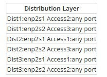
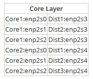

# Module 5 Labs: Configuring Routing and Advanced Switching

## Lab 5.1: Install an Enterprise Router
Complete this lab as follows:  
### Add the router to the empty slot near the top of the rack.
Under Shelf, expand Routers.  
Drag the Router to the first open space at the top of the rack in the Workspace.  
### Insert an SFP Transceiver (RJ45) into the WAN port on the router.
Under Shelf, expand Adapters.  
Drag the SFP Transceiver (RJ45) to the WAN port on the router.  
### Insert an SFP Transceiver (LC) into the LAN 1-4 ports.
Under Shelf, expand Adapters.  
Drag an SFP Transceiver (LC) to each of the LAN 1-4 ports on the router.  
### Use the AC power cable with C14 end to connect the router to a critical load bank outlet on one of the UPSs.
Above the rack, select Back to switch to the back view of the rack.  
Under Shelf, expand Cables.  
Select the AC Power Cable with C14 end.  
From the Selected Component pane, drag the AC Power Connector to the router and the AC Power Connector C14 to a critical load bank outlet on a UPS.  
### Connect the LAN 1 port on the router to ports 1 and 2 on the fiber patch panel using an SC to LC fiber cable.
Above the rack, select Front to switch to the front view of the rack.  
Select the SC to LC fiber cable.  
From the Selected Component pane:  
&emsp;* Drag the Duplex LC Fiber Connector to the LAN 1 port on the router.  
&emsp;* Drag the Fiber Optic SC Connector (A) to port 1 on the fiber patch panel.  
&emsp;* Drag the Fiber Optic SC Connector (B) to port 2 on the fiber patch panel.  
### Connect the LAN 2 port on the router to ports 3 and 4 on the fiber patch panel using an SC to LC fiber cable.
Under Cables on the Shelf, select the SC to LC fiber cable.  
From the Selected Component pane:  
&emsp;* Drag the Duplex LC Fiber Connector to the LAN 2 port on the router.  
&emsp;* Drag the Fiber Optic SC Connector (A) to port 3 on the fiber patch panel.  
&emsp;* Drag the Fiber Optic SC Connector (B) to port 4 on the fiber patch panel.  
### Connect the LAN 3 port on the router to ports 5 and 6 on the fiber patch panel using an SC to LC fiber cable.
Under Cables on the Shelf, select the SC to LC fiber cable.  
From the Selected Component pane:  
&emsp;* Drag the Duplex LC Fiber Connector to the LAN 3 port on the router.  
&emsp;* Drag the Fiber Optic SC Connector (A) to port 5 on the fiber patch panel.  
&emsp;* Drag the Fiber Optic SC Connector (B) to port 6 on the fiber patch panel.  
### Connect the LAN 4 port on the router to ports 7 and 8 on the fiber patch panel using an SC to LC fiber cable.
Under Cables on the Shelf, select the SC to LC fiber cable.  
From the Selected Component pane:  
&emsp;* Drag the Duplex LC Fiber Connector to the LAN 4 port on the router.  
&emsp;* Drag the Fiber Optic SC Connector (A) to port 7 on the fiber patch panel.  
&emsp;* Drag the Fiber Optic SC Connector (B) to port 8 on the fiber patch panel.  
### Connect the WAN port on the router to a port on the pfSense device at the top of the rack.
Under Cables on the Shelf, select the Cat6a Cable.  
From the Selected Component pane, drag one of the RJ45 Shielded Connectors to the WAN port on the router and the other to a port on the pfSense device above the router.  
## Lab 5.2: Cisco Troubleshooting Tools
Complete this lab as follows:  
### Prepare to enter commands on the SFO router.
Select SFO and press Enter.  
Type enable (or en) and press Enter to access privilege EXEC mode.  
### Verify the version of software in use.
Type show version (or sh ver) and press Enter.  
Press the space bar to advance and view the file.  
Select Questions and answer questions 1-3.  
Minimize the Lab Questions dialog.  
### Check the status of the interfaces.
Type show interfaces (or sh int) and press Enter.  
Press the space bar to advance and view the file.  
Select Questions and answer questions 4 and 5.  
Minimize the Lab Questions dialog.  
### Verify the settings in the router configuration files.
Type show startup-config (or sh start) and press Enter.  
Press the space bar to advance and view the file.  
Type show running-config (or sh run) and press Enter.  
Press the space bar to advance and view the file.  
Select Questions and answer question 6.  
Minimize the Lab Questions dialog.  
### View information about neighboring routers.
Type show cdp neighbors (or sh cdp ne) and press Enter.  
Select Questions and answer question 7.  
Minimize the Lab Questions dialog.  
### Test the connection from the SFO router to Wrk1 (192.168.11.1).
Type ping 192.168.11.1 and press Enter.  
Select Questions and answer question 8.  
Minimize the Lab Questions dialog.  
Close the SFO terminal window.  
### Switch to the Branch1 device and prepare to enter commands.
Select Branch1 and press Enter.  
Type en and press Enter to access privilege EXEC mode.  
### Test the path from Branch1 to the LAX router (172.17.12.97).
Type traceroute 172.17.12.97 and press Enter.  
Select Questions and answer question 9.  
### Lab 5.3: Configure NAT
Complete this lab as follows:  
### Sign into the pfSense management console.
In the Username field, enter admin.  
In the Password field, enter P@ssw0rd (zero).  
Select SIGN IN or press Enter.  
### Configure NAT port forwarding for the PC1 computer.
From the pfSense menu bar, select Firewall > NAT.  
Select Add (either one).  
Configure or verify the following settings:  
&emsp;* Interface: LAN  
&emsp;* Protocol: TCP  
&emsp;* Destination type: LAN address  
&emsp;* Destination port range (From and To): MS RDP  
&emsp;* Redirect target IP: 172.16.1.100  
&emsp;* Redirect target port: MS RDP  
&emsp;* Description: RDP from LAN to PC1  
Select Save.  
### Configure NAT port forwarding for the Kali Linux server.
Select Add (either one).  
Configure or verify the following settings:  
&emsp;* Interface: LAN  
&emsp;* Protocol: TCP  
&emsp;* Destination type: LAN address  
&emsp;* Destination port range (From and To): SSH  
&emsp;* Redirect target IP: 172.16.1.6  
&emsp;* Redirect target port: SSH  
&emsp;* Description: SSH from LAN to Kali  
Select Save.  
### Configure NAT port forwarding for the web server.
Select Add (either one).  
Configure or verify the following settings:  
&emsp;* Interface: LAN  
&emsp;* Protocol: TCP  
&emsp;* Destination type: LAN address  
&emsp;* Destination port range (From and To): Other  
&emsp; &emsp;* Custom (From and To) 5151  
&emsp;* Redirect target IP: 172.16.1.5  
&emsp;* Redirect target port: Other 5151  
&emsp;* Description: RDP from LAN to web server using custom port  
Select Save.  
Select Apply Changes.  
## Lab 5.4: Create a Three-Tier Network
Complete this lab as follows:  
### Create the default connection for each access layer switch as follows:
In the tools tray, select Create Link.  
Create the connections by doing the following:  
&emsp;* Select Access1 and then Access 1 port 0.  

&emsp;* Select Dist1 and then enp2s0.  
&emsp;* Select Access2 and then Access 2 port 0.  
&emsp;* Select Dist2 and then enp2s0.  
&emsp;* Select Access3 and then Access 3 port 0.  
&emsp;* Select Dist3 and then enp2s0.  
### Make the redundant connections from each distribution layer router to the other two switches.
From the top right, select Exhibits.  
Create the redundant connections as specified in the following table:  
   
### Implement the connections from the core layer to the distribution layer.
Use the network information from the exhibit to connect the core routers as follows:  
   
### Lab 5.5: Configure Switch IP and VLAN - GUI
Complete this lab as follows:  
### Log in to the Cisco switch.
In the Google Chrome URL field, type 192.168.0.2 and press Enter.  
Maximize the window for better viewing.  
In the Username and Password fields, enter cisco (case-sensitive).  
Select Log In.  
### Assign a static IPv4 address to VLAN 1.
From the left navigation pane, expand and select Administration > Management Interface > IPv4 Interface.  
From the right pane, for IP Address Type, select Static.  
Configure the IPv4 interface as follows:  
&emsp;* IP address: 192.168.45.72  
&emsp;* Mask: 255.255.255.0  
&emsp;* Administrative Default Gateway: 192.168.45.1  
Select Apply.  
Select OK.  
The switch will automatically log you out.  
### Log in to the Cisco switch.
In the Username and Password fields, enter cisco (case-sensitive).  
Select Log In.  
### Change the default VLAN ID for the switch to VLAN 16.
From the left pane, expand and select VLAN Management > Default VLAN Settings.  
Set Default VLAN ID After Reboot to 16.  
Select Apply and then select OK.  
### Save the changes to the switch's startup configuration file.
From the upper right of the switch window, select Save.  
For Source File Name, make sure Running configuration is selected.  
For Destination File Name, make sure Startup configuration is selected.  
Select Apply.  
Select OK.  
Select Done.  
### Reboot the switch for changes to take effect.
From the left pane, expand and select Administration > Reboot.  
From the right pane, select Reboot.  
Select OK.  
Wait for the switch to restart.  
## Lab 5.6: Create VLANs - GUI
Complete this lab as follows:
### Log in to the Cisco switch.
In the Username field for the Cisco switch, enter ITSwitchAdmin (case-sensitive).  
In the Password field, enter Admin$only (case-sensitive).  
Select Log In.  
### Create the IPCameras VLAN.
From the Getting Started pane (right), under Initial Setup, select Create VLAN.  
Select Add.  
For VLAN ID, enter 2.  
For VLAN Name, enter IPCameras.  
Select Apply.  
Select Close.  
### Configure the IPCameras VLAN ports.
From the left pane, under VLAN Management, select Port to VLAN.  
Using the VLAN ID equals to drop-down menu, select 2.  
Select Go.  
For ports GE18 through GE21, use the drop-down menus to select Untagged.  
Select Apply.  
### Connect the IP camera in the lobby to the VLAN and mount the IP cameras.
From the top left, select Floor 1.  
Under Lobby, select Hardware.  
Under Shelf, expand CCTV Cameras.  
Drag the IP Camera (Lobby) to the workspace.  
Under Workspace, for the IP camera, select Back to switch to the back view of the IP camera.  
Under Shelf, expand Cables and then select the Cat6a Cable, RJ45 cable.  
From the Selected Component pane:  
&emsp;* Drag an RJ45 Connector to the RJ-45 port on the IP camera wall mount plate.  
&emsp;* Drag the unconnected RJ45 Connector to the RJ-45 port on the back of the IP camera.  
Drag the IP camera to the IP camera wall plate.  
### Connect the IP camera in the Networking Closet to the VLAN and mount the IP cameras.
From the top left, select Floor 1.  
Under Networking Closet, select Hardware.  
Under Shelf, expand CCTV Cameras.  
Drag the IP Camera (Networking Closet) to the workspace.  
Under Workspace for the IP camera, select Back to switch to the back view of the IP camera.  
Under Shelf, expand Cables and then select the Cat6a Cable, RJ45 cable.  
From the Selected Component pane:  
&emsp;* Drag an RJ45 Connector to the RJ-45 port on the IP camera mount wall plate.  
&emsp;* Drag the unconnected RJ45 cable to the RJ-45 port on the back of the IP camera.  
Drag the IP camera to the IP camera wall plate to mount the IP camera.  
### Connect the DHCP server and laptop to the VLAN.
From the Networking Closet, under Shelf, select Cat6a Cable, RJ45.  
From the Selected Component pane:  
&emsp;* Drag an RJ45 Connector to port 21 on the switch.  
&emsp;* Drag the unconnected RJ45 Connector to port 21 on the patch panel.  
### Connect IT-Laptop5 to the VLAN.
From the top menu, select Floor 1.  
Under IT Administration, select Hardware.  
Above IT-Laptop5, select Back to switch to the back view of the laptop.  
Under Shelf, select Cat6a Cable, RJ45.  
From the Selected Component pane:  
&emsp;* Drag an RJ45 Connector to the RJ-45 port on the laptop.  
&emsp;* Drag the unconnected RJ45 Connector to the open RJ-45 port on the wall plate.  
&emsp; Note: To verify that all components are connected, you can change the location to the Network Closet hardware view. You should see green link/activity lights on ports 18 - 21 of the switch.  
### Launch the IP camera monitoring software.
Under the laptop's workspace, select Front.  
On the IT-Laptop5, select Click to view Windows 10.  
From the taskbar, select Start.  
Select IP Cameras.  
Verify that both cameras are detected on the network.  
## Lab 5.7: Configure Trunking
Complete this lab as follows:  
### Log in to the CISCO switch.
Click the Start button, then select Google Chrome.  
In the URL field, enter 192.168.0.2 and press Enter.  
Maximize the window for better viewing.  
In the Username and Password fields, enter cisco (the password is case sensitive).  
Select Log In.  
### Examine the switch port defaults.
From the left navigation bar, expand and select VLAN Management > Interface Settings.  
Using the interface shown in the right pane, examine the settings for all ports.  
&emsp;* Note: For a detailed view of a single port, you can select Edit.  
From the upper right, select Questions.  
Answer Question 1.  
Minimize the Lab Questions dialog.  
### Set ports GE1 through GE26 to Access Mode.
From the Interface Settings pane, select GE1.  
Select Edit.  
Maximize the window for better viewing.  
For Interface VLAN Mode, select Access.  
Select Apply and then select Close.  
With GE1 still selected, click Copy Settings.  
In the to field, type 2-26 and then select Apply.  
Notice that under the Interface VLAN Mode column, ports GE1-GE26 are now set to Access.  
### Set the port VLAN ID (PVID) for ports GE27-GE28 to the value of 2.
Select the desired port and then select Edit.  
For the Administrative PVID, enter 2.  
Select Apply and then Close.  
Repeat steps 4a - 4c for the second port.  
### Add VLANs 22, 44, and 67 to ports GE27 and GE28.
From the left pane, under VLAN Management, select Port VLAN Membership.  
Select port GE27 and then select Join VLAN.  
From the new window, hold down the Shift key and select VLANs 22, 44, and 67; then select the > button to assign the VLANs.  
Select Apply and then select Close.  
Repeat steps 5b - 5d for port GE28.  
### Save the changes to the switch's startup configuration file.
From the top of the switch window, select Save.  
For Source File Name, make sure Running configuration is selected.  
For Destination File Name, make sure Startup configuration is selected.  
Select Apply.  
Select OK.  
Select Done.  
## Lab 5.8: Configure Switch IP Settings - CLI
Complete this lab as follows:  
### Find the IP address assigned to the FastEthernet0/0 interface on the SFO router.
Select the Branch1 switch.  
From the Terminal, press Enter to get started.  
Type enable and press Enter to change to the EXEC or Global Configuration mode.  
Type show cdp neighbors detail and press Enter.  
Find the IP address for the SFO router.  
Answer the question.  
Move the question dialog to the side and keep working.  
### Configure the IP address and subnet mask for the Branch1 switch.
At the Branch1# prompt, type config t and press Enter.  
At the Branch1(config)# prompt, type interface vlan1 and press Enter.  
At the Branch1(config-if)# prompt, type ip address 192.168.11.250 255.255.255.0 and press Enter.  
At the Branch1(config-if)# prompt, type exit and press Enter.  
### Configure the switch to use the FastEthernet0/0 interface on the SFO router as the default gateway.
At the Branch1(config)# prompt, type ip default-gateway routers_IP_address and press Enter.  
At the Branch1(config)# prompt, type exit and press Enter.  
### Save your changes to the startup-config file.
At the Branch1# prompt, type copy run start and press Enter.  
Press Enter to begin building the configuration.  
When you see OK, press Enter.  
### Lab 5.9: Configure Management VLAN Settings - CLI
Complete this lab as follows:  
### Configure the IP address and subnet mask for the VLAN 1 interface.
Select Switch.  
From the switch terminal, press Enter to get started.  
At the Switch> prompt, type enable and press Enter.  
At the Switch# prompt, type configure terminal and press Enter.  
At the Switch(config)# prompt, type interface vlan1 and press Enter.  
At the Switch(config-if)# prompt, type ip address 192.168.11.250 255.255.255.0 and press Enter.  
Type exit and press Enter.  
### Configure the default gateway.
At the Switch(config)# prompt, type ip default-gateway 192.168.11.254 and press Enter.  
At the prompt, type exit and press Enter.  
### Verify the configuration changes.
At the prompt, type show run and press Enter.  
Press the space bar as needed to verify that the correct changes were made.  
### Type any key to exit show command.
Save your changes to the startup-config file.  
At the Switch# prompt, type copy run start and press Enter.  
Press Enter to begin building the configuration.  
Press Enter to return to the prompt.  