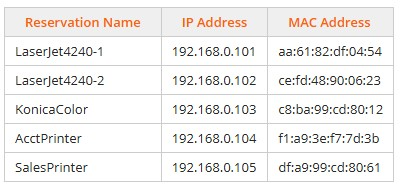

# Module 6 (Labs 1 - 13) Implementing Network Services
## Lab 1.2: Explore Three-Way Handshake in Wireshark
Complete this lab as follows:  
### Begin a Wireshark capture.
From the Favorites bar, select Wireshark.  
Maximize the window for easier viewing.  
Under Capture, select enp2s0.  
Select the blue fin to begin a Wireshark capture.  
Wait about 5 seconds, then select the red square to stop the Wireshark capture.  
### Apply a filter for tcp traffic from the computer at 192.168.0.45 and examine a SYN packet.
In the Apply a display filter field, type tcp and host 192.168.0.45 and press Enter.  
Look at the source and destination addresses of the filtered packets.  
### Examine a SYN packet
Select a packet that includes SYN in the Info column.  
In the center pane, expand Internet Protocol Version 4 and Transmission Control Protocol.  
Select Questions, then answer Questions 1 and 2.  
Minimize the Lab Questions dialog.  
### Examine an ACK, SYNPacket.
Select a packet that includeACK, SYN in the Info column.  
Select Questions, then answer Questions 3 and 4.  
Minimize the Lab Questions dialog.  
### Examine an ACK Packet.
Select a packet that includes ACK in the Info column.  
Select Questions, then answer Questions 5 and 6.  
## Lab 1.2: View Open Ports with netstat
### While completing this lab, use the following information:
   
Complete this lab as follows:  
### Use Zenmap to scan for open ports running VNC.
From the Favorites bar, select Zenmap.  
In the Command field, type nmap -p 5900 192.168.0.0/24.  
Select Scan.  
From the results, find the computer with port 5900 open.  
### Uninstall VNC from the suspect computer.
From the top navigation tabs, select Floor 1 Overview.  
Under Support Office, select Support.  
From the Favorites bar, select Terminal.  
At the prompt, type netstat -l and press Enter to confirm the port is open on the machine.  
Type dnf list vnc and press Enter to find the package name.  
Type dnf erase libvncserver and press Enter.  
Press y and press Enter to uninstall the package.  
### Type netstat -l and press Enter to confirm that the port has been closed on the machine.
## Lab 6.3: Configure a DHCP Server
Complete this lab as follows:  
### Access the CorpDHCP Hyper-V server.
From Hyper-V Manager, select CORPSERVER.  
Resize the window to view all virtual machines.  
Double-click CorpDHCP to access the server.  
Maximize the CorpDHCP server for better viewing.  
### Access the DHCP New Scope Wizard.
From Server Manager's menu bar, select Tools > DHCP.  
Expand CorpDHCP.CorpNet.local.  
Right-click IPv4 and select New Scope.  
### Name the scope and configure the IP address range.
From the New Scope Wizard, select Next.  
In the Name field, enter Subnet1 and then select Next.  
Enter 192.168.0.20 in the Start IP address field.  
Enter 192.168.0.200 in the End IP address field.  
Make sure the length is set to 24.  
Make sure the subnet mask is 255.255.255.0 and then select Next.  
From the Add Exclusions and Delay window, select Next.  
Use the default lease duration and select Next.  
Make sure Yes, I want to configure these options now is selected and then select Next.  
### Configure the default gateway and DNS server.
In the IP address field, enter 192.168.0.5 as the default gateway address.  
Select Add and then select Next.  
In the IP address field, enter 163.128.78.93 as the DNS server address.  
Select Add and then select Next.  
From the WINS Servers window, select Next.  
A### ctivate the scope just created.  
Make sure Yes, I want to activate this scope now is selected and then select Next.  
Click Finish to close the wizard and create the scope.  
### Configure the laptop in the Lobby to obtain IP and DNS addresses automatically from the DHCP server.
From the top left, select Floor 1 Overview.  
Under Lobby, select Gst-Lap.  
In the notification area of the taskbar, right-click the network icon and select Network and Internet settings.  
Select Ethernet.  
Scroll down to IP assignment: and select Edit.  
Change the top drop down from Manual to Automatic (DHCP), then click Save.  
## Lab 6.4: Configure DHCP Server Options
Explanation  
While completing this lab, the 006 DNS Servers options are 192.168.0.11 and 192.168.10.11 (in that order).  
Complete this lab as follows:  
### Access the CorpDHCP virtual server.
From Hyper-V Manager, select CORPSERVER.  
Maximize the Hyper-V Manager window to view the available server.  
Right-click CorpDHCP and select Connect.  
### Configure the DHCP server options.
From Server Manager, select Tools > DHCP.  
Maximize the DHCP window for better viewing.  
Expand CorpDHCP.CorpNet.local > IPv4.  
Right-click Server Options and select Configure Options.  
Under Available Options, select the 006 DNS Servers.  
Enter 192.168.0.11 under IP Address.  
Select Add to add the IP address to the list.  
Under IP Address, enter 192.168.10.11 for the second server and then select Add.  
From the top pane, scroll down and select 015 DNS Domain Name.  
In the String value field, enter CorpNet.local.  
Select OK to save the options that you have defined.  
### Configure DHCP scope options.
Expand Scope 192.168.0.1 Subnet1.  
Right-click Scope Options and select Configure Options.  
Under Available Options, select 003 Router.  
Enter 192.168.0.5 under IP address.  
Select Add to add the IP address to the list.  
Select OK to save the options you defined.  
&emsp; Note: Server options apply to every scope on the server. Scope options override the server settings for a specific scope.  
## Lab 6.5: Create DHCP Exclusions
Complete this lab as follows:  
### Access the CorpDHCP Hyper-V server.
From Hyper-V Manager, select CORPSERVER.  
Resize the window to view all virtual machines.  
Double-click CorpDHCP to access the server.  
### Exclude the IP address range.
From Server Manager's menu bar, select Tools > DHCP.  
Maximize the window for better viewing.  
Expand CorpDHCP.CorpNet.local > IPv4 > Scope 192.168.0.1 Subnet1.  
Right-click the Address Pool node and select New Exclusion Range.  
Enter 192.168.0.1 in the Start IP address field.  
Enter 192.168.0.29 in the End IP address field.  
Select Add.  
Select Close to close the Add Exclusion Range dialog.  
## Lab 6.6: Create DHCP Client Reservations
While completing this lab, use the following information:  
  
Complete this lab as follows:  
### Access the CorpDHCP virtual server.
From Hyper-V Manager, select CORPSERVER.  
Maximize the Hyper-V Manager window to view the available server.  
Double-click CorpDHCP to connect to the server.  
### Configure the IP address.
From Server Manager, select Tools > DHCP.  
Maximize the window for better viewing.  
From the left pane, expand CorpDHCP.CorpNet.local > IPv4 > Scope 192.168.0.1 Subnet1.  
Right-click Reservations and select New Reservation.  
In the Reservation name field, enter a reservation name.  
In the IP address field, enter the IP address.  
In the MAC address field, enter the MAC address.  
Under Supported types, select DHCP only (as needed).  
Select Add to create the client reservation.  
Select Yes to the DHCP prompt.  
Repeat steps 2e - 2j for additional reservations.  
Select Close.  
## Lab 6.7: Configure Client Addressing for DHCP
Complete the following in order:  
###View the current connection status.  
From the Floor 1 Overview, under Office 2, select Office2.  
Perform one of the following:  
&emsp; Hover over the network icon in the system tray or  
&emsp; Select Start > Settings > Network & internet.  
Select Questions and answer question 1.  
Minimize the Lab Questions dialog.  
### Determine how the IP address is currently assigned.
From Network & internet settings, select Ethernet.  
Select Questions and answer question 2.  
Minimize the Lab Questions dialog.  
### Make any necessary changes to fix the connection issues.
To the right of the IP assignment, select Edit.  
In the Edit IP settings dialog, use the dropdown menu and select Automatic (DHCP).  
Select Save and notice Office2 has a connection.  
## Lab 6.8: Explore APIPA Addressing
Complete this lab as follows:  
### To answer questions:
Select the Questions button to open the Lab Questions dialog.  
Answer the specified question.  
Minimize the Lab Questions dialog.  
### Discover the Exec computer IP address, and explore connectivity to other computers.
From Executive Office, select Exec.  
Right-click Start and select Terminal (Admin).  
At the command prompt, type ipconfig and press Enter.  
Answer question 1.  
Type ping 192.168.0.5 (Default Gateway) and press Enter.  
Type ping Office1 and press Enter.  
Type ping Office2 and press Enter.  
Answer question 2.  
### Discover the Office1 computer IP address, and explore connectivity to other computers.
From the top left, select Floor 1 Overview and under Office 1, select Office1.  
Right-click Start and select Terminal (Admin).  
At the command prompt, type ipconfig and press Enter.  
Answer question 3.  
Type ping 192.168.0.5 and press Enter.  
Type ping Office2 and press Enter.  
Type ping Exec and press Enter.  
Answer question 4.  
### Discover the Office2 computer IP address, and explore connectivity to other computers.
Select Floor 1 Overview and under Office 2, select Office2.  
Right-click Start and select Terminal (Admin).  
At the command prompt, type ipconfig and press Enter.  
Answer question 5.  
Type ping 192.168.0.5 (Default Gateway) and press Enter.  
Type ping Office1 and press Enter.  
Type ping Exec and press Enter.  
Answer questions 6 and 7.  
### From CorpServer in Hyper-V Manager, activate CorpDHCP Subnet1.
Select Floor 1 Overview and under Networking Closet, select CorpServer.  
Maximize the Hyper-V Manager window.  
In Hyper-V Manager, select CORPSERVER.  
In the middle pane, under Virtual Machines, double-click CorpDHCP.  
From the Server Manager dialog menu, select Tools and then DHCP.  
In the DHCP dialog, from the left pane, expand CorpDHCP > IPv4.  
Notice that the folder icon for the Subnet1 Scope displays a red arrow, indicating it is not active.  
Right-click Scope [198.168.0.1] Subnet1 and select Activate.  
### Verify that the Office1 computer is receving an IP adddress from CorpDHCP.
Select Floor 1 Overview and under Office 1, select Office1.  
(Conditional) If a PowerSehll window is not already open, right-click Start and select Terminal (Admin).  
At the command prompt, type ipconfig and press Enter.  
Answer question 8.  
Type ping 192.168.0.5 and press Enter.  
Notice that Office1 can now communicate with the CorpDHCP server.  
## Lab 6.9: Explore APIPA Addressing in Network Modeler
### Explanation
&emsp; The router in this lab is configured for DHCP and has an assigned gateway of 192.168.1.1 on Port 0.  
Complete this lab as follows:  
### Add the computers to the canvas
In the tools tray, select End Devices.  
Drag all three computers to the modeler canvas.  
### Add the switch to the canvas
In the tools tray, select Switches.  
Drag the switch to the modeler canvas.  
### Connect the computers to the switch
In the tools tray, select Create Link.  
Click on Home-PC1 and select the Ethernet port.  
Click on the Switch and select an open port.  
Click on Home-PC2 and select the Ethernet port.  
Click on the switch and select an open port.  
Click on Home-Laptop and select the Ethernet port.  
Click on the switch and select an open port.  
Select Create Link to end the link tool.  
### Test connectivity and ping Home-PC2
Right-click Home-PC1 and select Launch Windows.  
Right-click Start and select Terminal (Admin).  
Type ipconfig /all and press Enter.  
Type ping Home-PC2 and press Enter.  
Answer questions 1 through 3.  
### Add the router to the canvas
In the upper left, select Network Modeler to return to the diagram.  
In the tools tray, select Routers.  
Drag the router to the canvas.  
### Connect the switch to the router
In the tools tray, select Create Link.  
Click on the Router and select Port 0.  
Click on the switch and select an open port.  
Select Create Link to end the link tool.  
### Renew the IP address for Home-PC1
Right-click Home-PC1 and select Launch Windows.  
Right-click Start and select Terminal (Admin) (if a terminal window is not already open).  
In the terminal window, type ipconfig /renew.  
Type ipconfig /all.  
Answer question 4.  
### Test connectivity by pinging Home-PC2 and the gateway
In the terminal window, type ping Home-PC2.  
In the terminal window, type ping 192.168.1.1.  
Answer question 5.  
### Renew the IP address for Home-PC2
In the upper left, select Network Modeler to return to the diagram.  
Right-click Home-PC2 and select Launch Windows.  
Right-click Start and select Windows PowerShell (Admin).  
In the terminal window, type ipconfig /renew.  
Type ipconfig /all.  
### Test connectivity by pinging Home-PC1 and the gateway
In the terminal window, type ping Home-PC1.  
In the terminal window, type ping 192.168.1.1.  
Answer questions 6.  
&emsp; Note: Being connected to the same switch physically doesn't guarantee that the devices are on the same network. A switch only forwards packets based on MAC addresses at the Layer 2 level. The IP addresses (Layer 3) determine which network a computer belongs to. While a switch facilitates communication between devices connected to it, it doesn't determine their logical network.  
## Lab 6.10: Configure a DHCP Relay Agent
Complete this lab as follows:  
### Add the DHCP Relay Agent routing protocol.
From Server Manager, select Tools > Routing and Remote Access.  
Expand IPv4.  
Right-click General and select New Routing Protocol.  
Select DHCP Relay Agent and then select OK.  
### Add and configure a Relay Agent interface.
From the left pane, right-click DHCP Relay Agent and select New Interface.  
Select NetTeam and then select OK.  
Make sure Relay DHCP packets is selected.  
Set the boot threshold to 0 (zero).  
Select OK.  
### Configure the DHCP Relay Agent properties to identify the DHCP server.
Right-click DHCP Relay Agent and select Properties.  
In the Server address field, enter 192.168.0.14 (the IP address of the DHCP server).  
Select Add and then select OK.  
### Renew the TCP/IP address and verify the connection.
From the top left, select Floor 1.  
Under Manager Office, select Exec2.  
Right-click Start and select Terminal (Admin).  
In PowerShell, type ipconfig.  
Notice that the current IP address is on the 169.254.0.0 network.  
In PowerShell, type ipconfig /renew and then press Enter.  
The computer should receive an address on the 192.168.10.0 network.  
From the taskbar, right-click the network icon, and select Network and Internet settings to view the connection status.  
## Lab 6.11: Add a DHCP Server on Another Subnet
Complete this lab as follows:  
### Access the CorpDHCP virtual server.
From Hyper-V Manager, select CORPSERVER.  
Maximize the Hyper-V Manager window to view the available server.  
Double-click CorpDHCP to connect to the server.  
#### Create an IPv4 scope on the CorpDHCP.
From Server Manager, select Tools > DHCP.  
Expand the CorpDHCP.CorpNet.local server node.  
Right-click IPv4 and then select New Scope.  
Select Next.  
In the Name field, enter Sales and then select Next.  
Enter 192.168.10.21 in the Start IP address field.  
Enter 192.168.10.199 in the End IP address field.  
Select Next > Next > Next > Next.  
From the Router (Default Gateway) dialog, enter an IP address of 192.168.10.5 and then select Add.  
Select Next.  
From the Domain Name and DNS Server dialog, add two DNS server addresses as follows:  
&emsp; * In the IP address field, enter 198.28.56.108 and then select Add.  
&emsp; * In the IP address field, enter 163.128.78.93 and then select Add.  
Select Next > Next.
From the Activate Scope dialog, make sure that Yes, I want to activate this scope now is selected and then select Next.  
Select Finish to complete the process of creating the DHCP scope.  
## Lab 6.12: Troubleshoot Address Pool Exhaustion
Complete this lab as follows:  
### Run ipconfig /all on the seven marketing computers.
Under Marketing Group A, select Marketing1.  
At the top right, select Questions, then review (but do not answer) questions 1-4.  
Minimize the Lab Questions dialog.  
Right-click Start and then select Windows PowerShell (Admin).  
Maximize the terminal window for better viewing.  
From the terminal window, type ipconfig /all and press Enter.  
Note the DHCP results (as outlined in questions 1-3).  
From the top left, select Floor 2.  
Repeat Steps 1d-1g for the remaining marketing computers (2-7).  
&emsp; * Select Terminal (Admin) instead of Windows PowerShell (Admin).  
At the top right, select Questions.  
Use the ethernet adapter information to answer questions 1-3.  
Minimize the Lab Questions dialog.  
### On the first floor, under the Networking Closet, view the properties of CorpServer subnet1 scope.
From the top left, select Building A.  
Under Building A, select Floor 1.  
Under Networking Closet, select CorpServer.  
Maximize the Hyper-V Manager window for better viewing.  
Under Hyper-V Manager, select CORPSERVER.  
Double-click CorpDHCP to connect to the CorpDHCP virtual server.  
From the Server Manager dialog menu, select Tools and then select DHCP.  
On the left, expand CorpDHCP.CorpNet.local > IPv4.  
Right-click Scope 192.168.0.1 Subnet1 and select Properties.  
At the top right, select Questions.  
Answer question 4 and then minimize the Lab Questions dialog.  
### Set the End IP address for the Scope [192.168.0.1] Subnet1 to 192.168.0.254.
From the Scope 192.168.0.1 Subnet1 Properties dialog, change the End IP address to 192.168.0.254.  
Select OK.  
### Select a computer with a connectivity issue and run ipconfig /renew.
From the top left, select Building A.  
Under Building A, select Floor 2.  
Select a computer that previously had an APIPA address.  
From the open terminal window, type ipconfig /renew and press Enter.  
At the top right, select Questions.  
Answer question 5.  
## Applied Live Lab 6.13: Troubleshoot Address Pool Exhaustion
Live lab environment  