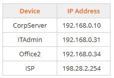
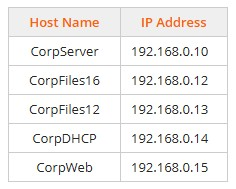

# Module 6 (Labs 14- 26) Implementing Network Services
## Lab 6.14: Explore DHCP Troubleshooting
Complete this lab as follows:  
### From CorpServer, check network connectivity.
Right-click CorpServer and select Launch Windows.  
Mouse over the Network icon in the Notification Area.
&emsp; Note that the Notification Area appears normal (a computer icon is shown), which indicates a connection to the local network and the internet. When you mouse over the Network icon, you see the details of this status.  
### Access the Network & Internet settings.
Right-click Start and then select Settings.  
Select Network & Internet.  
&emsp; The Network Status diagram confirms that CorpServer is connected to the local network and to the internet.  
### Ping the ISP to verify connectivity through the router and the internet.
From the top left, select Network Modeler.  
Locate the IP address of the ISP Internet Router.  
From the top right, select Questions and answer question 1.  
Minimize the Lab Questions dialog.  
On CorpServer, Launch Windows.  
Right-click Start and select Windows PowerShell (Admin).  
From the PowerShell prompt, type ping, followed by a space and the ISP's IP address from Question 1, and press Enter.  
Notice that the ping was successful, verifying a valid connection to the internet.  
### Use the ipconfig and tracert commands to find the devices used to access the ISP.
From the PowerShell prompt, type ipconfig /all and press Enter.  
Locate and examine the vEthernet (External) configuration settings and note the following:  
&emsp; * DHCP Enabled: No. This tells us that the server is configured with a static IP address and is not enabled for DHCP.  
&emsp; * IPv4 Address: 192.168.0.10  
&emsp;  *Subnet Mask: 255.255.255.0. The server is using the default subnet mask for the Class C IP address range.  
&emsp; * Default Gateway: 192.168.0.5. The router's internal interface is configured as the default gateway.  
From the PowerShell prompt, type tracert ISP_IPaddress to see the path to the ISP.  
From the top right, select Questions and answer question 2.  
From the top left, select Network Modeler.  
Answer Question 3.  
Minimize the Lab Questions dialog.  
### From Exec, check the status of the link and network activity lights.  
Right-click Exec and select Launch Windows.  
From the top left, select Executive Office.  
Above the workstation, select Back to switch to the back view of the workstation.  
&emsp; The link and network activity lights on the network card are on and blinking. This indicates that there's a physical connection to the switch and there's activity on the connection. This points to a TCP/IP configuration problem.  
### Verify the connectivity on the Exec workstation.
On the Exec monitor, select Click to view Windows 11.  
In the Notification Area, mouse over the Network icon.  
&emsp; Notice that the pop-up indicates there is no internet access.  
Right-click Start and then select Settings.  
Select Network & internet.  
&emsp; The Network & internet status diagram confirms that the Exec computer has no connection to the internet.  
Right-click Start and select Terminal (Admin).  
From the Terminal prompt, type ping Exec and then press Enter.  
&emsp; Notice that the ping was successful  
From the Terminal prompt, type ping CorpServer and then press Enter.  
&emsp; Notice that the ping to CorpServer failed.  
From the PowerShell prompt, type ipconfig /all and then press Enter. From this command the following is shown for the Ethernet interface card:  
&emsp; * DHCP Enabled: No  
&emsp; * IPv4 Address: 192.168.0.62  
&emsp; * Subnet Mask: 255.255.255.240  
&emsp; *  Default Gateway: 192.168.0.4  
&emsp; This information provides the following clues to the problem:  
&emsp; * The network is using DHCP, but this workstation is not enabled for DHCP.  
&emsp; * Given the workstation's current subnet mask, the workstation's IPv4 address and the default gateway are not on the same network.  
&emsp; * The subnet mask is not the default subnet mask for the Class C IP address range being used. With 255.255.255.240 as a subnet mask, the network would only include addresses from 192.168.0.48 to 192.168.0.63.  
&emsp; * In Step 4, you learned that CorpServer (192.168.0.10) had a default subnet mask for the Class C IP address range (255.255.255.0), which doesn't match Exec.  
### Fix the subnet mask for the Exec computer.
From Settings > Network & Internet, select Ethernet.  
Under IP assignment, select Edit.  
Change the Subnet mask to: 255.255.255.0 and then select Save.  
From the Terminal prompt, type ping CorpServer and then press Enter.  
&emsp; Notice the ping is now successful.  
Type ping 198.28.2.254 (the ISP) and then press Enter.  
&emsp; Notice the ping is still unsuccessful.  
Type tracert 198.28.2.254 (the ISP) and then press Enter.  
&emsp; The command times out, indicating that the gateway address on Exec is not configured correctly. The gateway address (router) on the network diagram is 192.168.0.5.  
### Fix the default gateway for the Exec computer.
From Settings > Network & Internet > Ethernet.  
Under IP assignment, select Edit.  
Change the Default gateway to 192.168.0.5 and then select Save.  
From the Settings app, select Network & Internet again.  
&emsp; The Status diagram now shows a connection to the internet.  
Close the Settings app.  
Notice that the network icon in the Notification Area is now showing a computer, indicating a connection to the internet.  
From the Terminal prompt, type ping 198.28.2.254.  
The ping is now successful.
Type tracert 198.28.2.254 and press Enter.  
The route taken to get to the ISP is now shown. Since there is now a valid connection to the internet, leave the static address for now and begin to troubleshoot the Office1 computer.  
Select Network Modeler to return to the network diagram.  
### From Office1, troubleshoot for network connectivity.
Right-click Office1 and select Launch Windows.  
From the top left, select Office 1.  
Above the workstation, select Back to switch to the back view of the workstation.  
&emsp; The link and network activity lights on the back of the workstation are on and blinking, indicating that there's a physical connection to the switch and there's activity on the connection. Once again, this points to a TCP/IP configuration problem.  
On the Office1 monitor, select Click to view Windows 11.  
In the Notification Area, mouse over the Network icon.  
&emsp; Notice that the pop-up indicates there is no internet access.  
Right-click Start and select Terminal (Admin).  
From the Terminal prompt, type ipconfig /all and then press Enter. Examine the information for the Ethernet network card and note the following:  
&emsp; * DHCP Enabled: Yes. This tells us that the workstation is configured to use a DHCP server.  
&emsp; * IPv4 Address: This address is in the APIPA range (169.254.0.1 to 169.254.255.254). This means that the workstation assigned itself an IP address instead of receiving one from the DHCP server. The workstation will only be able to communicate with other hosts on the local network that have also configured their own IP address through APIPA.  
&emsp; * Subnet Mask: 255.255.0.0. This is the default subnet mask for the APIPA address.  
&emsp; * Default Gateway: The address is blank. This means that communication is limited only to other workstations on the local network.  
&emsp; * DHCP Server line is not shown. This means that the workstation was unable to contact the DHCP server.  
&emsp; * DNS Servers line is not shown for IPv4.  
&emsp; * Since DHCP is enabled, the rest of the information should have come from the DHCP server. From this, you can conclude that there's an issue with the DHCP server.  
Select Network Modeler to return to the network diagram.  
### From CorpDHCP, launch the DHCP console and activate the scope.
Right-click CorpDHCP and select Launch Windows.  
From the Server Manager menu bar, select Tools > DHCP.  
Expand CorpDHCP.CorpNet.local > IPv4.  
&emsp; Notice that the folder icon for Scope 192.168.0.1 Subnet1 has a down arrow, indicating that the DHCP scope is not active.  
Right-click Scope 192.168.0.1 Subnet1 and select Activate.  
Select Network Modeler to return to the network diagram.  
### From Office1, check to see if activating DHCP fixed the issue.
Right-click Office1 and select Launch Windows.  
From the Terminal prompt, type ipconfig /renew and press Enter. This command will request new IP address information from the DHCP server.  
&emsp; Notice that the networking icon in the Notification Area still indicates that Office1 has no connection to the internet.  
From the Terminal prompt, type ipconfig /all and press Enter.  
&emsp; Notice that the line for the default gateway, DNS server, and DHCP server (along with the new IP address) is now within the DHCP scope for the local network.  
From the Terminal prompt, type ping CorpServer and press Enter  
The ping command is successful.  
From the Terminal prompt, type ping 198.28.2.254 (the ISP) and press Enter.  
Although you can ping CorpServer, you are still unable to ping the ISP.  
Review the output from the ipconfig command.  
&emsp; Notice that the default gateway does not match the default gateway used by CorpServer or Exec. Since this IP information is coming from the DHCP server, you need to check the DHCP scope.  
Select Network Modeler to return to the network diagram.  
### From CorpDHCP, reconfigure the settings for th  e DHCP scope.
Right-click CorpDHCP and select Launch Windows.
From the DHCP console, expand Scope 192.168.0.1 Subnet1.  
Right-click Scope Options and then select Configure Options.  
Highlight the 003 Router line.  
Under IP address, select 192.168.0.2 and then click Remove.  
In the IP address field, change the address to 192.168.0.5 and then click Add.  
Select OK.  
Select Network Modeler to return to the network diagram.  
From Office1, check to see if fixing the DHCP scope resolved the issue.  
Right-click Office1 and select Launch Windows.  
From the Terminal prompt, type ipconfig /renew and press Enter. This command requests new IP address information from the DHCP server.  
&emsp; Notice that the networking icon in the Notification Area now indicates that Office1 has a connection to the internet.  
From the Terminal prompt, type ipconfig /all and press Enter.  
&emsp; Notice that the line for the default gateway is now set to 192.168.0.5.  
From the Terminal prompt, type ping 198.28.2.254 (the ISP) and press Enter.  
&emsp; You can now ping the ISP.  
Select Network Modeler to return to the network diagram.  
### On Exec, reconfigure the Ethernet connection to use DHCP.
Right-click Exec and select Launch Windows.  
Right-click Start and then select Settings.  
Select Network & Internet.  
Select Ethernet.  
Under IP assignment, select Edit.  
Under Edit IP settings, select Automatic (DCHP) and then select Save.  
From the Terminal prompt, type ipconfig /all and press Enter.  
&emsp; Notice that the Ethernet card is now using DHCP (DHCP Enable: Yes).  
Type tracert 198.28.2.254 and press Enter.  
&emsp; The command returns a path to the ISP through the gateway. The network is now fully functional, and your troubleshooting is complete.  
### Lab 6.15: Troubleshoot IP Configuration 1
### While completing this lab, use the following information:
  
Complete this lab as follows:  
### From the Office2 computer, use the ping and ipconfig commands to test connectivity and gather information.
Right-click Office2 and select Launch Windows.  
Right-click Start and select Terminal (Admin).  
From the Terminal prompt, type ping IP_address and press Enter.  
Repeat step 1c to ping the remaining computers.  
From the top right, select Questions.  
Answer Question 1.  
Minimize the Lab Questions dialog.  
From the Terminal prompt, type ipconfig /all and press Enter.  
&emsp; Notice that DHCP Enabled is set to Yes, meaning the IP information is obtained from a DHCP server.  
From the top right, select Questions.  
Answer Question 2.  
Minimize the Lab Questions dialog.  
From the top left, select Network Modeler to return to the network diagram.  
From the ITAdmin computer, use the ping and ipconfig commands to test connectivity and gather information.  
Right-click ITAdmin and select Launch Windows.  
Right-click Start and select Terminal (Admin).  
From the Terminal prompt, type ping IP_address and press Enter.  
Repeat step 2c to ping the remaining computers.  
From the top right, select Questions.  
Answer Question 3.  
Minimize the Lab Questions dialog.  
From the PowerShell prompt, type ipconfig /all and press Enter.  
&emsp; Notice that DHCP Enabled is set to Yes, meaning the IP information is obtained from a DHCP server.  
From the top right, select Questions.  
Answer Question 4.  
Minimize the Lab Questions dialog.  
From the top left, select Network Modeler to return to the network diagram.  
From the CorpServer computer, use the ping and ipconfig commands to test connectivity and gather information.  
Right-click CorpServer and select Launch Windows.  
Right-click Start and select Windows PowerShell (Admin).  
From the PowerShell prompt, type ping Office2 and press Enter.  
Type ping 198.28.2.254 and press Enter.  
&emsp; Notice that this computer can get to the internet.  
Type ipconfig and press Enter.  
From the top right, select Questions.  
Answer Question 5.  
&emsp; Since Office2 and ITAdmin obtain their IP addresses from a DHCP server and their default gateway is different from CorpServer (which can access the internet), the problem is most likely related to the IP configuration for the network.  
Minimize the Lab Questions dialog.  
Close PowerShell.  
From the top left, select Network Modeler to return to the network diagram.  
From the CorpDHCP server, use the DHCP console to reconfigure the settings for the DHCP scope.  
Right-click CorpDHCP and select Launch Windows.  
From the Server Manager menu bar, select Tools > DHCP to start the DHCP console.  
Expand and select CorpDHCP > IPv4 > Scope [192.168.0.1] Subnet1 > Scope Options.  
Right-click Scope Options and then select Configure Options.  
Highlight the 003Router option.  
In the bottom pane, select 192.168.0.4 and then select Remove.  
In the IP address field (the default gateway address), change the address listed to 192.168.0.5 and select Add.  
Select OK to apply the change.  
From the top left, select Network Modeler to return to the network diagram.  
Verify that the ITAdmin and Office2 computers can access the internet.  
Right-click ITAdmin and select Launch Windows.  
From the Terminal prompt, type ipconfig /renew.  
This will request the new IP address information from the DHCP server and reconfigure the settings for the Ethernet connection.  
Enter ipconfig /all to check the Ethernet configuration.  
&emsp; Notice that the default gateway is now correctly configured as 192.168.0.5.  
At the PowerShell prompt, type ping 198.28.2.254 (the ISP) and then press Enter.  
From the top left, select Network Modeler to return to the network diagram.  
Right-click Office2 and select Launch Windows.  
Repeat steps 6b-6d to fix the problem for the second workstation.  
## Lab 6.16: Troubleshoot IP Configuration 2
Complete this lab as follows:  
### Troubleshoot
### From the Exec computer, begin troubleshooting by verifying the scope of the connectivity problem.
Right-click Exec and select Launch Windows.  
Right-click Start and then select Terminal (Admin).  
From the Terminal prompt, run the following ping commands. Press Enter after each command:  
&emsp; * ping 192.168.0.10 (CorpServer)  
&emsp; * ping 198.28.2.254 (The Internet Service Provider, or ISP)  
&emsp; &emsp; Notice that both pings are unsuccessful.  
ping ITAdmin (the name of the computer in the IT Administration office).  
&emsp; * Notice that the ping to ITAdmin is successful. However, it is responding using an APIPA IP address. This indicates that this computer is not getting its IP address from the DHCP as it should.  
### From Exec, use the ipconfig /all command to continue troubleshooting.
From the Terminal prompt, type ipconfig /all and press Enter.  
From the top right, select Questions.  
Answer Question 1.  
Minimize the Lab Questions windows.  
From the top left, select Network Modeler to return to the network diagram.  
### From the ITAdmin computer, continue troubleshooting the problem by trying additional ping tests.
Right-click ITAdmin and select Launch Windows.  
Right-click Start and then select Terminal (Admin).  
From the Terminal prompt, run the following ping commands. Press Enter after each command:  
&emsp; * ping 192.168.0.10 (CorpServer)  
&emsp; * ping 198.28.2.254 (the ISP)  
&emsp; &emsp; Notice that the ping to the ISP fails.  
&emsp; * ping exec (the name of the computer in the Executive Office)  
&emsp; &emsp; Notice that the ping to the ITAdmin is successful. However, the Exec computer is responding with an APIPA IP address.  
### From ITAdmin, use the ipconfig /all command to continue troubleshooting.
From the Terminal prompt, type ipconfig /all and press Enter.  
From the top right, select Questions.  
Answer Question 2.  
Minimize the Lab Questions windows.  
From the top left, select Network Modeler to return to the network diagram.  
### From the CorpServer computer, continue troubleshooting the problem by trying to access the ISP.
Right-click CorpServer and select Launch Windows.  
Right-click Start and then select Windows PowerShell (Admin).  
From the PowerShell prompt, type ping 198.28.2.254 (the ISP).  
&emsp; Notice that the ping to the ISP is successful.  
Type tracert 198.28.2.254 and press Enter.  
From the top left, select Network Modeler to return to the network diagram.  
From the top right, select Questions.  
Answer Questions 3 and 4.  
Minimize the Lab Questions windows.  
### Fix the Issue
Since it appears that the DHCP server is not functioning correctly, check the current state of the DHCP services.  
### From CorpDHCP, confirm that the DHCP service is enabled and activated for the local network.
Right-click CorpDHCP and select Launch Windows.  
From Server Manager, select Tools > DHCP to start the DHCP console.  
Maximize the window for better viewing.  
Expand CorpDHCP.CorpNet.local > IPv4.  
The down arrow for Scope [192.168.0.1] Subnet1 indicates that the scope is not active.  
Right-click Scope [192.168.0.1] Subnet1 and select Activate.  
The down arrow for the scope is gone, and the DHCP service for the local network is now active.  
From the top left, select Network Modeler to return to the network diagram.  
### Verify the fix by viewing the IP information for Exec and using the ping command.
Right-click Exec and select Launch Windows.    
From the Terminal prompt, type ipconfig /all and press Enter to check the Ethernet configuration.
&emsp; Notice the lines for the default gateway, DNS server, and DHCP server are now configured, along with a new IP address within the DHCP scope for the local network.  
Type ping 198.28.2.254 and press Enter.  
Notice that the ping to the ISP succeeds.  
Type tracert 198.28.2.254 and press Enter.  
(Optional) Repeat step 2 for the ITAdmin computer  
## Lab 6.17: Troubleshoot IP Configuration 3
Complete this lab as follows:  
### roubleshooting
### From the Office1 computer, use the ping command to begin troubleshooting the problem by verifying the scope of the connectivity issues.
Right-click Office1, and select Launch Windows.  
Right-click Start and then select Terminal (Admin).  
From the Terminal prompt, run the following ping commands (press Enter after each command):  
&emsp; * ping 192.168.0.10 (CorpServer)  
&emsp; * ping 192.168.0.31 (ITAdmin)  
ping 198.28.2.254 (the internet service provider)  
&emsp; &emsp; Notice that all pings were unsuccessful.  
From the top left, select Network Modeler to return to the network diagram.  
From the ITAdmin computer, use the ping and ipconfig /all commands to continue determining the scope of the connectivity issues.  
Right-click ITAdmin, and select Launch Windows.  
Right-click Start and then select Terminal (Admin).  
From the Terminal prompt, run the following ping commands (press Enter after each command):  
&emsp; * ping 192.168.0.10 (CorpServer)  
&emsp; * ping 192.168.0.33 (Office2)  
&emsp; * ping 192.168.0.30 (Exec)  
&emsp; * ping 198.28.2.254 (the internet service provider)  
&emsp; &emsp; Notice that all the pings were successful.  
Type ipconfig /all and press Enter.  
From the top right, select Questions.  
Answer Questions 1-3.  
From the top left, select Network Modeler to return to the network diagram.  
From Office1, use the ipconfig /all command to analyze the differences between Office1 and ITAdmin IP information.  
Right-click Office1, and select Launch Windows.  
From the Terminal prompt, type ipconfig /all and then press Enter.  
Answer Questions 4-7.  
Minimize the Lab Questions dialog.  
### Fixing the Issue
From your troubleshooting steps, you found that Office1 was the only computer having connectivity issues. As you examined and compared Office1's IP settings, you found that it was using the wrong subnet mask and DNS server. Since DHCP was not being used (DHCP Enabled was set to NO), the IP information must have been manually entered using bad or outdated information.  
You will now rectify the issue by configuring the Office1 computer to obtain its IP information from the DHCP server.  
### From Office1, configure the network connection to request the IP address information from the DHCP server:
Right-click Start and then select Settings.  
Select Network & internet.  
Select Ethernet.  
Under IP assignment, select Edit.  
Under Edit IP settings, select Automatic (DHCP).  
Select Save.  
Close Settings.  
Verify that Office1 is now able to connect to the internet.  
From the Terminal prompt, type ipconfig /all. Verify the following settings:  
&emsp; * DHCP Enable: Yes  
&emsp; * Subnet mask: 255.255.255.0  
&emsp; * DNS Servers:  
&emsp; &emsp; * 192.168.0.11  
&emsp; &emsp; * 192.168.10.11  
From the Terminal prompt, run the following ping commands (press Enter after each command):  
&emsp; * ping 192.168.0.10 (CorpServer)  
&emsp; * ping 192.168.0.31 (ITAdmin)  
&emsp; * ping 198.28.2.254 (the internet service provider)  
&emsp; &emsp; Notice that all pings are successful.  
## Lab 6.18: Configure DNS Addresses
While completing this lab, use the following DNS information:  
&emsp; * Preferred DNS server: 208.67.222.222  
&emsp; * Alternate DNS server: 208.67.222.220  
Complete this lab as follows:  
### Access the Ethernet properties dialog.
Under Dorm Room, select Dorm-PC.  
Right-click the Network icon in the taskbar's notification area and select Network and Internet settings.  
From the right pane, select Ethernet.  
Under DNS server assignment, select Edit.  
### Configure the new DNS addresses.
Under Edit DNS settings, select Manual.  
Select IPv4 to toggle it to On.  
Enter the Preferred DNS.  
Enter the Alternate DNS.  
Select Save.  
## Lab 6.19: Create Standard DNS Zones
Complete this lab as follows:  
### Access the CorpDC virtual server.
From Hyper-V Manager, select CORPSERVER.  
Double-click CorpDC to connect to the server.  
Maximize the window for better viewing.  
### Create a primary forward lookup zone.
From Server Manager, select Tools > DNS.  
Maximize the window for better viewing.  
Expand CORPDC (the server that will host the zone).  
Right-click Forward Lookup Zones and select New Zone.  
In the New Zone wizard, select Next.  
Make sure Primary zone is selected.  
Clear Store the zone in Active Directory (this option is only available for domain controllers) and then select Next.  
In the Zone name field, enter acct.CorpNet.local for the zone and then select Next.  
Verify that Create a new file with this file name is selected and then click Next.  
Make sure Do not allow dynamic updates is selected and then click Next.  
Select Finish to complete the New Zone wizard.  
### Configure zone transfers.  
Expand Forward Lookup Zones.  
Right-click acct.CorpNet.local (the new zone) and select Properties.  
Select the Zone Transfers tab.  
Verify that Allow zone transfers is selected.  
Select To any server.  
Select OK.  
### Create a forward secondary zone.
Expand CORPDC3 (the server that will host the new zone).  
Right-click Forward Lookup Zones and then select New Zone.  
Select Next.  
Select Secondary zone as the zone type and then select Next.  
In the Zone name field, enter acct.CorpNet.local and then select Next.  
In the Master Servers box, select Click here.  
Enter 192.168.0.11 or CorpDC.CorpNet.Local as the server that hosts a copy of the zone.  
Press Enter or click away from the IP address to begin validation.  
After validation is complete, select Next.  
Click Finish to complete the New Zone wizard.  
### Lab 6.20: Create Host Records
While completing this lab, use the following information:  
  
Complete this lab as follows:  
### Access the CorpDC virtual server.
From Hyper-V Manager, select CORPSERVER.  
Double-click CorpDC to connect to the server.  
Maximize the window for better viewing.  
### Create a primary reverse lookup zone.
From Server Manager, select Tool > DNS.  
Expand CORPDC.  
Right-click Reverse Lookup Zones and select New Zone.  
Select Next.  
Make sure that Primary zone is selected.  
Make sure that Store the zone in Active Directory is selected and then select Next.  
Keep the default replication scope setting and select Next.  
Keep the default reverse lookup zone settings and select Next.  
For Network ID, use 192.168.0 as the network ID.  
Select Next.  
Keep the default dynamic update settings and then select Next.  
Select Finish.  
### Create a host (A) and associated pointer (PTR) record.
From DNS Manager, expand Forward Lookup Zones.  
Right-click CorpNet.local and select New Host (A or AAAA).  
In the Name field, enter the hostname.  
In the IP address field, enter the IP address.  
Select Create associated pointer (PTR) record as needed. The reverse lookup zone must exist for this record to be created.  
Select Add Hosts.  
Select OK for the prompt shown.  
Repeat steps 3c through 3g to add the additional host records.  
Select Done.  
## Lab 6.21: Create CNAME Records
Complete this lab as follows:  
### Access the CorpDC virtual server.
From Hyper-V Manager, select CORPSERVER.  
Double-click CorpDC to connect to the server.  
Maximize the window for better viewing.  
### For the sales.private zone, create the ALIAS (CNAME) record with a blank name pointing to CorpWeb.CorpNet.local.
From Server Manager, select Tools > DNS.  
Maximize the window for better viewing.  
Expand CORPDC > Forward Lookup Zones.  
Right-click the sales.private zone and select New Alias (CNAME).  
Configure the new record as follows:  
&emsp; * Alias name: Leave blank  
&emsp; * Fully qualified domain name (FQDN) for target host: CorpWeb.CorpNet.local  
Select OK.  
### For the sales.private zone, create the intranet ALIAS (CNAME) record pointed to CorpWeb.CorpNet.local.
Right-click the sales.private zone and select New Alias (CNAME).  
Configure the new record as follows:  
&emsp; * Alias name: intranet  
&emsp; * Fully qualified domain name (FQDN) for target host: CorpWeb.CorpNet.local  
Select OK.  
### For the sales.private zone, create the www ALIAS (CNAME) record pointed to CorpWeb.CorpNet.local.
Right-click the sales.private zone and select New Alias (CNAME).  
Configure the new record as follows:  
&emsp; * Alias name: www  
&emsp; * Fully qualified domain name (FQDN) for target host: CorpWeb.CorpNet.local  
Select OK.  