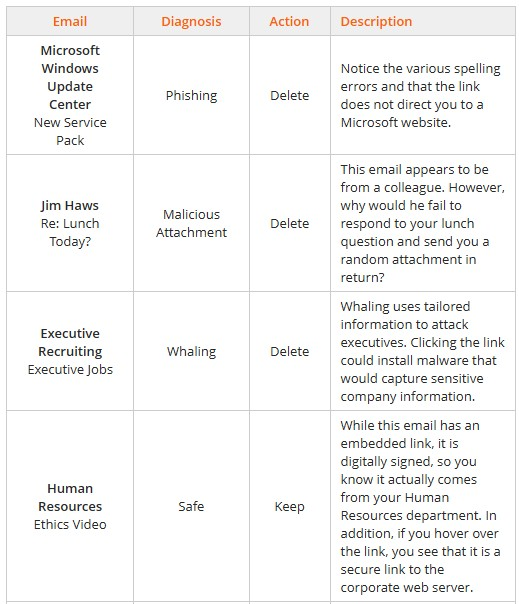
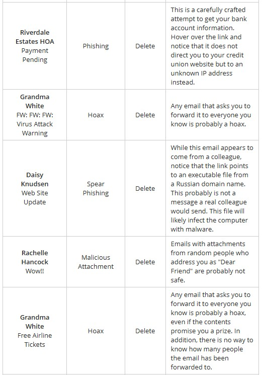
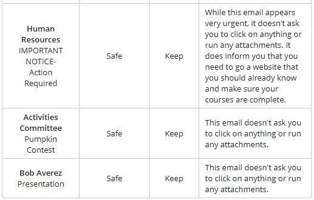

# Module 9 Labs: Explaining Network Security Concepts
## Lab 9.1: Create a Honeypot
Complete this lab as follows:  
### Use Pentbox to create a honeypot on www_stage.
From the Favorites bar, select Terminal.  
At the prompt, type cd pentbox-1.8 and press Enter to change to the pentbox directory.  
Type ./pentbox.rb and press Enter to start Pentbox.  
Type 2 and press Enter to select Network Tools.  
Type 3 and press Enter to select Honeypot.  
Type 1 and press Enter to select Fast Auto Configuration.  
### From the Analyst-Lap computer, test the honeypot using Google Chrome.
From the top navigation tabs, select Buildings.  
Under Blue Cell, select Analyst-Lap.  
From the taskbar, select Google Chrome.  
In the URL field, enter www_stage.corpnet.xyz and press Enter.  
In the top right, select Questions.  
Answer Question 1.  
Minimize the Lab Questions dialog.  
### Review the effects of the intrusion on www_stage.
From the top navigation tabs, select Buildings.  
Under Building A, select Basement.  
Under Basement, select www_stage.  
&emsp; Notice the INTRUSION ATTEMPT DETECTED message at the bottom of the Pentbox window.  
### Answer the questions.
In the top right, select Questions.  
Answer Question 2.  
## Lab 9.2: Analyze a DoS Attack
Complete this lab as follows:  
### Using Wireshark, capture packets on the enp2s0 interface.
From the Favorites bar, select Wireshark.  
Under Capture, select enp2s0.  
Select the blue fin to begin a Wireshark capture.  
### Using a Terminal, ping CorpTest (192.168.10.19).
From the Favorites bar, select Terminal.  
At the prompt, type ping CorpTest (or 192.168.10.19) and press Enter.  
In Wireshark, apply a display filter by typing icmp (lower case). Note the packets captured in Wireshark.  
After a few seconds, type Ctrl-C to stop the ping. Clear the display filter.  
### Filter the packet capture to show only SYN packets, then start a SYN flood.
In Wireshare's Apply a display filter field, type tcp.flags.syn==1 and press Enter.  
From the Terminal, type hping3 --syn --flood CorpTest (or 192.168.10.19) and press Enter to start a TCP SYN flood against the CorpTest server.  
After a few seconds of capturing packets, select the red box to stop the Wireshark capture.  
### Examine the captured packets and answer the question.
Maximize the Wireshark window for better viewing.  
In the top pane of Wireshark, select one of the packets captured with a destination address of 192.168.10.19.  
In the middle pane of Wireshark, expand Transmission Control Protocol.  
Scroll down to Flags.  
&emsp; Notice that the Flags item in this pane and the data in the Info column in the top pane show that this (and all the packets) is a SYN packet.  
In the top right, select Questions.  
Answer the question.  
## Lab 9.3: Analyze a DDoS Attack
Complete this lab as follows:  
### Use Wireshark to capture packets and filter for packets with the SYN flag set.
From the Favorites bar, select Wireshark.  
Under Capture, select enp2s0.  
From the menu, select the blue fin to begin the capture.  
In the Apply a display filter field, type tcp.flags.syn==1 and tcp.flags.ack==0 and press Enter to filter the Wireshark display to show packets with only the SYN flag.  
&emsp; Notice that there is a flood of SYN packets being sent to 198.28.1.1 (www.corpnet.xyz).  
### Use a filter to display only packets that have the SYN flag and the ACK flag set.
In the Apply a display filter field, change the ending of the tcp.flags.ack portion from a 0 to a 1 and press Enter to filter the Wireshark display to only those packets with both the SYN flag and ACK flag.  
&emsp; You should notice that there are far fewer SYN-ACK packets than SYN packets. The server is so busy that it can't respond to all of the packets.
Select the red square to stop the capture.  
### Use a filter only to display packets that contain the ACK flag and answer the question.
In the Apply a display filter field, change the ending of the tcp.flags.syn portion from a 1 to a 0 and press Enter to filter the Wireshark display to packets with only the ACK flag.  
&emsp; You should see ACK packets, but none of them are being sent to 198.28.1.1 (www.corpnet.xyz). In a SYN attack, the ACK packets are never sent so that it ties up the half-open connections on the server.  
In the top right, select Questions.  
Answer the question.  
## Lab 9.4: Poison ARP and Analyze with Wireshark
Complete this lab as follows:  
### Use Wireshark to capture packets on enp2s0.
From the Favorites bar, select Wireshark.  
Maximize the window for better viewing.  
Under Capture, select enp2s0.  
From the menu bar, select the blue fin to begin a Wireshark capture.  
After capturing packets for five seconds, select the red box to stop the Wireshark capture.  
### Filter for only ARP packets.
In the Apply a display filter field, type arp and press Enter to only show ARP packets.  
In the Info column, look for the lines containing the 192.168.0.2 IP address.  
### Answer the questions.
## Lab 9.5: Spoof MAC Addresses with SMAC
Complete this lab as follows:  
### Find the MAC and IP addresses assigned to the Ethernet card in Office2.
Right-click Start and then select Terminal (Admin).  
From the prompt, type ipconfig /all and press Enter.  
From the top right, select Questions.  
Answer Questions 1 and 2.  
Minimize the Lab Questions dialog.  
### Find the MAC and IP addresses assigned to the Ethernet card in ITAdmin.
From the top left, select Floor 1 Overview.  
Under IT Administration, select ITAdmin.  
Right-click Start and then select Windows PowerShell (Admin).  
From the prompt, type ipconfig /all and press Enter.  
From the top right, select Questions.  
Answer Questions 3 and 4.  
Minimize the Lab Questions dialog.  
### Spoof the MAC address.
In the Windows search bar, type SMAC.  
Under Best match, right-click SMAC and select Run as administrator to open this app.  
In the New Spoofed Mac Address field, type the MAC address assigned to Office2.  
Select Update MAC of Ethernet card.  
Select OK to confirm the adapter restart.  
### Renew the IP information for the ITAdmin computer.
From the PowerShell prompt, type ipconfig /renew and press Enter to renew the IP address.  
Type ipconfig /all to confirm that the MAC address and the IP address have been updated.  
From the top right, select Questions.  
Answer Question 5.  
## Lab 9.6: PComplete this lab as follows:
Complete this lab as follows:  
### From IT-Laptop, start unified sniffing on the enp2s0 interface.
From the Favorites bar, select Ettercap.  
Select Sniff > Unified sniffing.  
From the Network Interface drop-down list, select enp2s0.  
Select OK.  
Select Mitm > DHCP spoofing and then configure the Server Information as follows:  
&emsp; * Netmask: 255.255.255.0.  
&emsp; * DNS: 192.168.0.11.
Select OK.  
### Find the current default gateway for Support.
From the top left, select Floor 1 Overview.  
Under Support Office, select Support.  
From the Favorites bar, select Terminal.  
Type route and press Enter.  
From the top right, select Questions.  
Answer Question 1.  
Minimize the Lab Questions dialog.  
### Start a Wireshark capture that filters for bootp packets.
From the Favorites bar, select Wireshark.  
Under Capture, select enp2s0.  
Select the blue fin to begin a Wireshark capture.  
In the Apply a display filter field, type bootp and press Enter.  
### Request a new IP address from the DHCP server for the enp2s0 interface.
At the terminal prompt:  
&emsp; * Type ip link set enp2s0 down and press Enter to bring the interface down.  
&emsp; * Type ip link set enp2s0 up and press Enter to bring the interface back up.  
Maximize Wireshark for easier viewing.  
&emsp; In Wireshark, under the Info column, notice there are two DHCP ACK packets. One is the legitimate acknowledgment (ACK) packet from the DHCP server and the other is the spoofed ACK packet.  
### Determine which DHCP ACK packet is the spoofed packet.
Select one of the DHCP ACK packets received.  
In the middle panel, expand Bootstrap Protocol (ACK).  
Expand Option: (3) Router.  
Make a note of the IP address used by the router.  
Repeat steps 5a-5c for the second ACK packet.  
From the top right, select Questions.  
Answer the Questions 2 and 3.  
Minimize Wireshark and the Lab Questions dialog so you can see the terminal window.  
At the terminal prompt, type route and press Enter.  
&emsp; Notice that the current gateway is now 192.168.0.46.  
This is the address of the computer performing the on-path (man-in-the-middle) attack.  
### On Office1, view the current default gateway and the route to the rmksupplies.com site.
From the top left, select Floor 1 Overview.  
Under Office 1, select Office1.  
Right-click Start and select Terminal (Admin).  
At the PowerShell prompt, type tracert rmksupplies.com and press Enter.  
&emsp; Notice that the first hop is 192.168.0.5.  
Type ipconfig and press Enter to view the IP address configuration for the computer.  
The configuration for Office1 is:  
&emsp; * IP address: 192.168.0.33  
&emsp; * Default Gateway: 192.168.0.5  
At the prompt, type ipconfig /release and press Enter to release the currently assigned addresses.  
Type ipconfig /renew and press Enter to request a new IP address from the DHCP server.  
&emsp; Notice that the default gateway has changed to the attacker's computer, which has an IP address of 192.168.0.46.  
Type tracert rmksupplies.com and press Enter.  
&emsp; Notice that the first hop is now 192.168.0.46 (the address of the attacker's computer).  
### Using Google Chrome, log into the rmksupplies.com Employee Portal.
From the taskbar, select Google Chrome.  
Maximize the window for easier viewing.  
In the URL field, enter rmksupplies.com and press Enter.  
At the bottom of the page, select Employee Portal and login using the following:  
&emsp; * Username: bjackson.  
&emsp; * Password: $uper$ecret1.
Select Login.  
&emsp; You are logged in as Blake Jackson.  
### From IT-Laptop, find the captured username and password in Ettercap.
From the top left, select Floor 1 Overview.  
Under IT Administration, select IT-Laptop.  
Maximize Ettercap.  
In Ettercap's bottom pane, find the username and password used to log in to the Employee Portal.erform a DHCP Spoofing On-Path Attack  
## Lab 9.7: Discover a Rogue DHCP Server
Complete this lab as follows:  
### Use Wireshark to capture and filter DHCP traffic.
From the Favorites bar, select Wireshark.  
Under Capture, select enp2s0.  
Select the blue fin to begin a Wireshark capture.  
In the Apply a display filter field, type bootp and press Enter.  
### Disable and enable the enp2s0 network interface.
From the Favorites bar, select Terminal.  
At the prompt, type ip addr show and press Enter to view the current IP configuration.  
Type ip link set enp2s0 down and press Enter.  
Type ip link set enp2s0 up and press Enter to enable the interface and request an IP address from the DHCP server.  
### Locate the rogue and legitimate DHCP servers.
Maximize the Wireshark window for better viewing.  
In Wireshark, under the Source column, find the IP addresses of the rogue and legitimate DHCP servers that sent the DHCP Offer packets.  
Answer the questions.  
## Lab 9.8: Configure DHCP Snooping
Complete this lab as follows:  
### Enable DHCP snooping globally on SwitchA.
Select SwitchA.  
In the terminal, press Enter to get started.  
At the SwitchA> prompt, type enable and press Enter.  
At the SwitchA# prompt, type config t and press Enter.  
At the SwitchA(config)# prompt, type ip dhcp snooping and press Enter.  
### Enable DHCP snooping for VLAN1.
At the SwitchA(config)# prompt, type ip dhcp snooping vlan 1 and press Enter.  
At the SwitchA(config)# prompt, type int fa0/24 and press Enter.  
### Configure the port that the DHCP server is connected to as a trusted interface for DHCP snooping.
At the SwitchA(config-if)# prompt, type ip dhcp snooping trust and press Enter.  
At the SwitchA(config-if)# prompt, type exit and press Enter.  
### Enable dynamic ARP inspection for VLAN1.
At the SwitchA(config)# prompt, type ip arp inspection vlan 1 and press Enter.  
Press Ctrl + Z.  
### Save the changes to the startup-config file.
At the SwitchA# prompt, type copy run start and press Enter.  
Press Enter to begin building the configuration.  
Press Enter to return to the prompt.  
### Lab 9.9: Poison DNS
Complete this lab as follows:  
### From the Support computer, use Ettercap to begin sniffing and scanning for hosts.
From the Favorites bar, select Ettercap.  
Select Sniff > Unified sniffing.  
From the Network Interface drop-down menu, select enp2s0.  
Select OK.  
Select Hosts >Scan for hosts.  
### Configure the Exec computer (192.168.0.30) as the target 1 machine.
Select Hosts > Host list.  
Under IP Address, select 192.168.0.30.  
Select Add to Target 1 to assign it as the target.  
### Initiate DNS spoofing.
Select Plugins > Manage the plugins.  
Select the Plugins tab.  
Double-click dns_spoof to activate it.  
Select Mitm > ARP poisoning.  
Select Sniff remote connections and then select OK.  
### From the Exec computer, access rmksupplies.com.
From the top left, select Floor 1 Overview.  
Under Executive Office, select Exec.  
From the taskbar, select Google Chrome.  
In the URL field, type rmksupplies.com and then press Enter.  
&emsp; Notice that the page was redirected to RUS Office Supplies despite the web address staying the same.  
## Lab 9.10: Analyze DNS Spoofing
Complete this lab as follows:  
### View normal access to the RMK Office Supplies website.
From the Favorites bar of the Linux computer named Support, select Google Chrome.  
In the URL field, type rmksupplies.com and press Enter.  
Notice that you are taken to the RMK Office Supplies site.
Close Google Chrome.  
### Use Ettercap to begin unified sniffing on the enp2s0 interface.
From the Favorites bar, select Ettercap.  
Select Sniff > Unified sniffing.  
From the Network Interface drop-down list, select enp2s0.  
Select OK.  
### Set Exec (192.168.0.30) as the target machine.
Select Hosts > Scan for hosts.  
Select Hosts > Host list.  
Under IP Address, select 192.168.0.30.  
Select Add to Target 1 to assign it as the target.  
### Initiate DNS spoofing using an Ettercap plugin.
Select Plugins > Manage the plugins.  
Select the Plugins tab.  
Double-click dns_spoof to activate it.  
### Initiate ARP poisoning on remote connections.
Select Mitm > ARP poisoning.  
Select Sniff remote connections.  
Select OK.  
### From Exec, access rmksupplies.com.
From the top navigation tabs, select Floor 1 Overview.  
Under Executive Office, select Exec.  
From the taskbar, select Google Chrome.  
In the URL field, type rmksupplies.com and press Enter.  
Answer the question.  
## Applied Live Lab 9.11: Analyze Network Attacks
Live Lab  
## Lab 9.12: Respond to Social Engineering Exploits
Complete this lab as follows:  
### Read each email and determine whether the email is legitimate.
Delete any emails that are attempts at social engineering.  
Keep all emails that are safe.  
The following table lists a summary of the results:  
  
  
  
## Lab 9.13: Crack a Password with John the Ripper
Complete this lab as follows:  
### Crack the root password on Support.
From the Favorites bar, select Terminal.  
At the prompt, type cd /usr/share/john and press Enter to change directories to the folder containing the John the Ripper password file.  
Type ls and press Enter to list the files in the directory.  
Type cat password.lst and press Enter to view the password list. This is an abbreviated list.  
Type cd and press Enter to go back to root.  
Type john /etc/shadow and press Enter to crack the Linux passwords.  
Notice that the root password of 1worm4b8 was cracked.
Type john /etc/shadow and press Enter to attempt to crack the Linux passwords again.  
Notice that it does not attempt to crack the password again. The cracked password is already stored in the john.pot file.  
Type cat ./.john/john.pot and press Enter to view the contents of the john.pot file.  
Type john /etc/shadow --show and press Enter as an alternate method of viewing the previously cracked password.  
From the top right, select Questions.  
Answer Question 1.  
Minimize the Lab Questions dialog.  
### Crack the password of the protected.zip file.
From the top left, select Floor 1 Overview.  
Under IT Administration, select IT-Laptop.  
From the Favorites bar, select Terminal.  
At the prompt, type ls and press Enter to view the contents of the home directory. Notice the protected.zip file you wish to crack.  
Type zip2john protected.zip > ziphash.txt and press Enter to copy the hashes to a text file.  
Type cat ziphash.txt and press Enter to confirm that the hashes have been copied.  
Type john --format=pkzip ziphash.txt and press Enter to crack the password.  
Type john ziphash.txt --show and press Enter to show the password.  
From the top right, select Questions.  
Answer Question 2.  